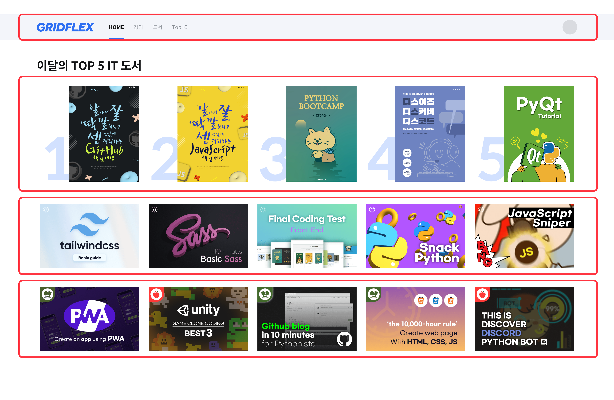
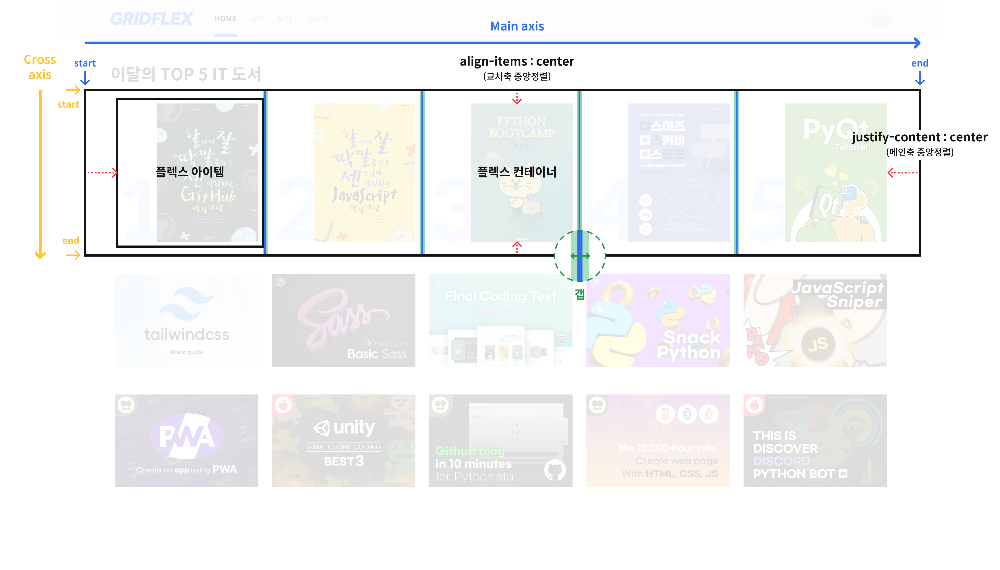
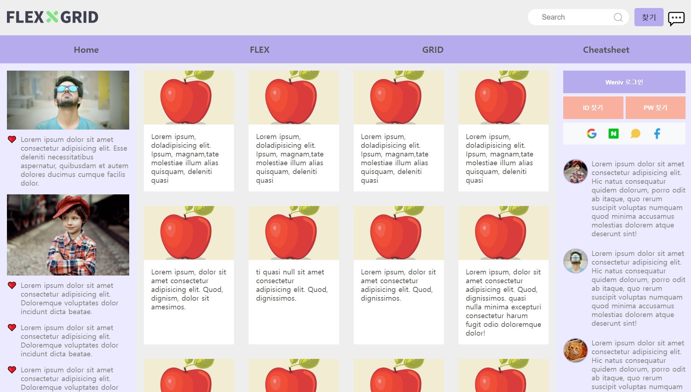
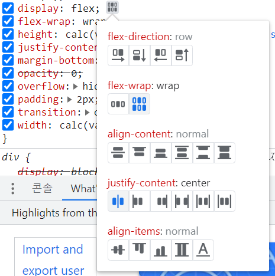
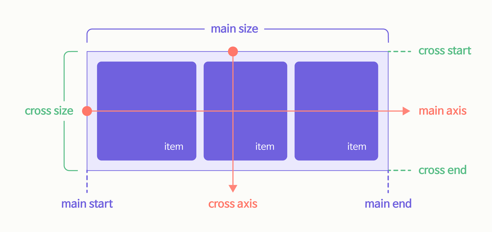
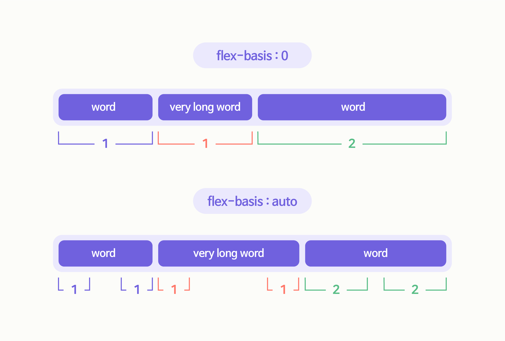
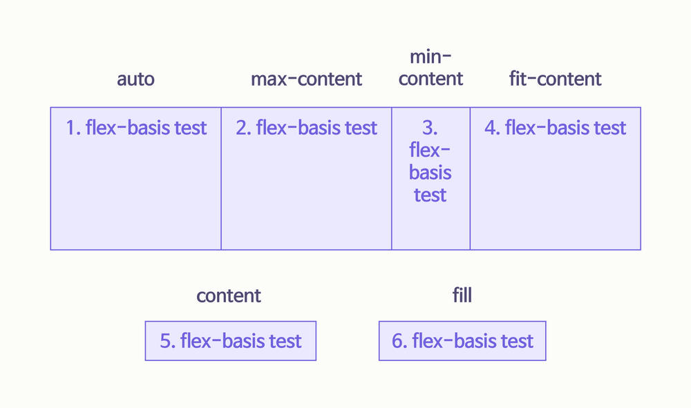
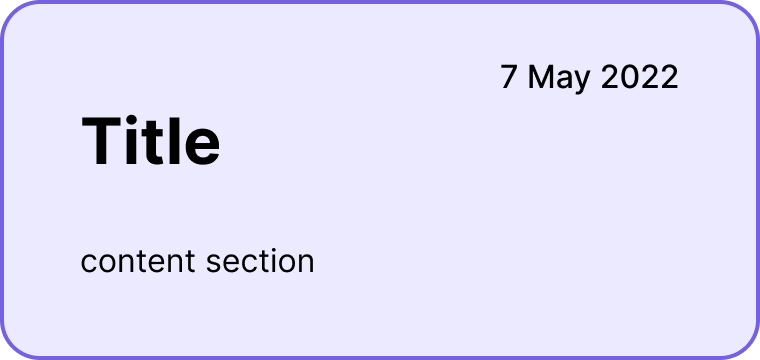

# 1. Flex

## 1.1. 들어가기에 앞서

기기가 다양해짐에 따라 화면 크기도 다양하게 변화되었다. 다양한 기기에 대응하기 위해 웹 서비스를 유연하게 만드는 것은 선택이 아닌 필수가 되었다. 다양한 화면의 크기에 맞추어 유연하게 대응할 수 있는 레이아웃을 만들기 위해 새롭게 추가된 속성이 Flex와 Grid이다. **Flex는 1차원 적인 레이아웃**을 잡을 때 사용하며, **grid는 2차원 적인 레이아웃**을 잡을 때 용이하다.

<br />

**Flex**는 부모 요소(컨테이너) 아래에서 자식 요소(아이템)들이 **한 방향으로 배치**가 된다. 따라서 **행 또는 열** 한 가지 방향으로 레이아웃을 배치해야 하는 경우에 사용한다. 또한 다양한 속성을 통해 자식 요소 사이를 일정한 간격으로 줄 수 있고 정렬하기가 매우 편하다.

<br />

Grid는 **행과 열 Matrix 형태로** 레이아웃을 배치해야 하는 경우 사용한다. 원하는 요소를 어디서부터 어디까지, 어느 방향으로 차지하게 할 건지 정하고 배치하면 된다.

<br />

지금부터 ‘알아서 잘 딱 깔끔하고 센스 있게’ Flex를 배워보자.

## 1.2. flex의 대표적인 구성요소

같은 이미지로 grid도 설명하니 비교해보면서 보길 권한다. 첫번째 이미지에 있는 빨간색 박스를 모두 flex로 구현할 수 있다.





## 1.3. Flex를 알면 만들 수 있는 것

카드를 순서대로 배치할 수 있고, 각 카드 내부에서 Flex를 이용해서 요소를 보다 쉽게 배치할 수 있다.


Flex를 활용한 홈페이지다. 로고 배치, 검색창, 메뉴 모든 UI에 flex를 활용하였다.



## 1.4. Flex의 특징

Flex는 부모와 자식 태그가 필요하고, 부모 요소(`flex-container`)와 자식 요소(`flex-item`)에 적용하는 속성이 구분되어 있다. 이 때, 속성의 영향은 **컨테이너의 직계자식까지만 영향**을 준다는 특징이 있으니 주의해야 한다. `flex-container`에는 정렬 방식과 item의 배치 흐름을 정의하고, `flex-item`에는 크기, 속성, 순서를 정의한다.

<br />

- `flex-container`의 속성 : **flex-direction, flex-wrap, justify-content, align-items, align-content** 등
- `flex-item`의 속성 : **flex, flex-grow, flex-shrink, flex-basis, align-self, order, z-index** 등

|                 | 기본 속성 | 적용 대상                  |
| --------------- | --------- | -------------------------- |
| flex-direction  | row       | flex containers            |
| justify-content | normal    | flex containers            |
| align-items     | normal    | all elements               |
| align-content   | normal    | multi-line flex containers |
| flex-wrap       | nowrap    | flex containers            |
| flex-basis      | auto      | flex items                 |
| flex-grow       | 0         | flex items                 |
| flex-shrink     | 1         | flex items                 |

어떠한 속성을 적용해야 하는지 헷갈리는 경우, 컨테이너에 flex 속성을 적용한 뒤 크롬 개발자 도구의 스타일 탭을 확인하면 좋다. 주요한 속성 다섯 가지를 GUI 기능으로 제공하여 적용된 모습을 확인해볼 수 있기 때문이다.



## 1.5. axis와 cross-axis

### 1.5.1. axis란?

axis로 자식 요소의 정렬 방향을 제어할 수 있다. 행방향, 열방향으로 각각 반대 방향도 지원한다.



### 1.5.2. 주축과 교차축

- **Main Axis**

Flex의 주축이 되는 main axis의 방향은 `flex-direction` 이라는 속성에 의해 결정된다. 이는 다음과 같이 **네 가지의 경우**가 있다.

`flex-direction` 속성에 `row-reverse` 또는 `column-reverse` 값을 사용하면 DOM 구조와 시각적 표현에 차이가 발생하여 스크린 리더로 접근하는 사용자에게 잘못된 정보를 전달 할 가능성이 있으니 주의를 요한다.

1. `flex-direction: row` : `flex-direction` 의 기본값으로 아이템들이 행 방향, 가로로 배치된다.
2. `flex-direction: row-reverse` : 아이템들이 역순으로 가로로 배치된다.
3. `flex-direction: column` : 아이템들이 열 방향으로, 세로로 배치된다.
4. `flex-direction: column-reverse` : 아이템들이 역순으로 세로로 배치된다.

<br />

- **Cross Axis**

Cross axis는 Main axis 방향의 수직 방향이다. Main axis가 `flex-direction` 에 의해 결정되었다면, Cross axis는 main axis 방향에 따라 결정이 된다.

## 1.6. 기본 속성 정보

### 1.6.1. display:flex

Flex는 자식요소(아이템)이 그 자식요소(아이템)을 포함하는 부모 요소(컨테이너)의 공간에 맞춰 그 크기를 줄이거나, 늘이고 또는 부모 요소(컨테이너)에 맞춰 그 정렬을 맞추는 css display의 하나의 속성이다. flex를 보여주는 간단한 예로 살펴보자.

# 2. flex-direction

`flex-direction` 이란 flex container 내의 item들의 정렬 방향을 결정하는 속성이다. `flex-direction`은 자식요소(아이템)의 부모요소인 (컨테이너)에 적용하여 사용하며 종류는 `row`, `row-reverse`, `column`, `column-reverse` 네 가지가 있다.

## 2.1. flex-direction : row

왼쪽에서 오른쪽으로 글씨가 써지는 **행 방향 정렬**이며, `flex-direction`을 따로 설정하지 않으면 초깃값으로 설정된다.

```editor
<div data-mode="snippet" class="fg-editor css-flex">
  <code>
    .container {
      display: flex;
      flex-direction: row;
    }
  </code>
</div>
```

## 2.2. flex-direction : row-reverse

`row`와 동일하게 보여지지만 시작점과 끝점이 반대로 위치한다.

```editor
<div data-mode="snippet" class="fg-editor css-flex">
  <code>
    .container {
      display: flex;
      flex-direction: row-reverse;
    }
  </code>
</div>
```

컨테이너 내에 위치한 아이템들을 유연하게 정렬 할 수 있으며, 역순으로 정렬한다. 컨테이너에게 `display: flex` 속성을 부여하지 않으면 아이템은 유연하게 움직이지 않는다.

## 2.3. flex-direction : column

Flex 내 box들을 수직으로 정렬한다. 컨테이너 내부의 요소들이 아이템이 아닌 경우 해당 속성의 값은 적용되지 않는다. `flex-direction : column;`일 때 주축은 세로 방향이 되고, 교차 축은 가로 방향이 된다. 아이템을 추가하는 경우 마크업 순서에 맞게 위에서 아래로 흐르듯이 정렬된다.

```editor
<div data-mode="snippet" class="fg-editor css-flex">
  <code>
    .container {
      display: flex;
      flex-direction: column;
    }
  </code>
</div>
```

## 2.4. flex-direction : column-reverse

`column` 과 동일하게 보여지지만 시작 점과 끝 점이 반대로 위치한다.

```editor
<div data-mode="snippet" class="fg-editor css-flex">
  <code>
    .container {
      display: flex;
      flex-direction: column-reverse;
    }
  </code>
</div>
```

## 2.5. 접근성 고려사항

`flex-direction` 속성에 `row-reverse` 또는 `column-reverse` 값을 사용하면 DOM 구조와 시각적 표현에 차이가 발생하여 스크린 리더로 접근하는 사용자에게 잘못된 정보를 전달 할 가능성이 있다.

# 3. justify-content

justify-content는 main-axis로 어떻게 정렬할지 정하는 코드이다.

## 3.1. **flex-start, center, flex-end**

```editor
<div data-mode="snippet" class="fg-editor css-flex">
  <code data-snippet="flex-start">
    .container {
      display: flex;
      justify-content: flex-start;
    }
  </code>
  <code data-snippet="center">
    .container {
      display: flex;
      justify-content: center;
    }
  </code>
  <code data-snippet="flex-end">
    .container {
      display: flex;
      justify-content: flex-end;
    }
  </code>
</div>
```

## 3.2. space-between, space-around, space-evenly

`space-between`, `space-around`, `space-evenly`는 차례로 ‘사이에’, ‘둘레에’, ‘균등하게’라는 뜻이다. 뜻을 생각하며 아래 그림으로 차이점을 확인해 보자.

```editor
<div data-mode="snippet" class="fg-editor css-flex">
  <code data-snippet="space-between">
    .container {
      display: flex;
      justify-content: space-between;
    }
  </code>
  <code data-snippet="space-around">
    .container {
      display: flex;
      justify-content: space-around;
    }
  </code>
  <code data-snippet="space-evenly">
    .container {
      display: flex;
      justify-content: space-evenly;
    }
  </code>
</div>
```

# 4. align-items, align-content

align의 사전적 정의는 ‘일직선으로 맞추다’이다. 즉, flex에서 align이란 축의 수직 방향 정렬을 의미하며, 부모요소(컨테이너) 안에서 교차 축에 따라 자식요소(아이템)가 정렬되는 속성이다.

## 4.1 align-items

```editor
<div data-mode="snippet" class="fg-editor css-flex">
  <code data-hidden="true">
    .container {
      min-height: 250px;
      height: 100%;
    }
    .item {
      height: auto;
    }
  </code>
  <code data-snippet="stretch(기본값)">
    .container {
      display: flex;
      align-items: stretch;
    }
  </code>
  <code data-snippet="flex-start">
    .container {
      display: flex;
      align-items: flex-start;
    }
  </code>
  <code data-snippet="center">
    .container {
      display: flex;
      align-items: center;
    }
  </code>
  <code data-snippet="flex-end">
    .container {
      display: flex;
      align-items: flex-end;
    }
  </code>
  <code data-snippet="baseline" data-item="4">
    .container {
      display: flex;
      align-items: baseline;
    }
    .item1 {
      font-size: 16px;
    }
    .item2 {
      height: 150px;
      font-size: 40px;
    }
    .item3 {
      height: 100px;
      font-size: 28px;
    }
    .item4 {
      font-size: 16px;
    }
  </code>
</div>
```

## 4.2. align-content

`align-items`는 한 줄을 기준으로 정렬하지만, `align-content`는 `flex-wrap: wrap` 이 설정된 경우 두 줄부터 기준으로 정렬한다. 아래 예시를 보면, 더 쉽게 알 수 있다.

```editor
<div data-mode="snippet" class="fg-editor css-flex">
  <code data-hidden="true">
    .container {
      min-height: 250px;
      height: 100%;
    }
    .item {
      height: auto;
    }
  </code>
  <code data-snippet="stretch(기본값)" data-item="8">
    .container {
      display: flex;
      flex-wrap: wrap;
      align-content: stretch;
    }
    .item {
      width: 20%;
    }
  </code>
  <code data-snippet="flex-start" data-item="8">
    .container {
      display: flex;
      flex-wrap: wrap;
      align-content: flex-start;
    }
    .item {
      width: 20%;
    }
  </code>
  <code data-snippet="center" data-item="8">
    .container {
      display: flex;
      flex-wrap: wrap;
      align-content: center;
    }
    .item {
      width: 20%;
    }
  </code>
  <code data-snippet="flex-end" data-item="8">
    .container {
      display: flex;
      flex-wrap: wrap;
      align-content: flex-end;
    }
    .item {
      width: 20%;
    }
  </code>
  <code data-snippet="space-between" data-item="8">
    .container {
      display: flex;
      flex-wrap: wrap;
      align-content: space-between;
    }
    .item {
      width: 20%;
    }
  </code>
  <code data-snippet="space-around" data-item="8">
    .container {
      display: flex;
      flex-wrap: wrap;
      align-content: space-around;
    }
    .item {
      width: 20%;
    }
  </code>
  <code data-snippet="space-evenly" data-item="8">
    .container {
      display: flex;
      flex-wrap: wrap;
      align-content: space-evenly;
    }
    .item {
      width: 20%;
    }
  </code>
</div>
```

# 5. flex-wrap

웹페이지 레이아웃을 구성할 때 부모 요소(컨테이너) 안의 자식 요소(아이템)들이 많으면 고민할 때가 있다. 예를 들어 영어 단어 웹페이지를 만든다고 가정해보자. 단어 카드들을 한 줄에 길게 배치할 것인지 아니면 한 줄이 아닌 두 줄 이상으로 배치할지 고민이 들 때가 있다.

```editor
<div data-mode="snippet" class="fg-editor css-flex">
  <code data-hidden="true">
    .container {
      padding: 10px;
      border: 3px solid var(--gray-8);
      border-radius: 16px;
    }
  </code>
  <code data-item="6">
    .container {
      display: flex;
      width: 200px;
    }
    .item {
      width: 40px;
    }
  </code>
</div>
```

flex-wrap 속성을 사용하게 되면, 부모 요소(컨테이너)의 크기만큼 단어 카드들의 크기를 조절할 수도 있고, 단어 카드들의 크기만큼 영역을 차지하고 부모 요소(컨테이너)의 영역을 벗어나게 되면 단어 카드를 밑으로 내려서 정렬도 할 수 있게 된다.

flex-wrap 속성은 Flex 레이아웃 모듈의 하위 속성이다. 정렬된 요소들의 총 너비가 부모 너비보다 클 때, 요소들을 강제적으로 한 줄로 할 것인지 여러 줄로 할 것인지를 정의한다. 두 줄 이상인 경우 새로운 라인이 쌓일 방향을 결정하는 교차 축도 정의된다. 가로축은 메인축에 수직인 축이다. 부모 요소에 `display:flex;`를 꼭 작성해야한다.

## 5.1. flex-wrap: nowrap

flex-wrap 속성 중 nowrap의 속성에 대해서 알아보자. flex-wrap는 작성자가 따로 설정하지 않는다면 기본값인 nowrap으로 설정된다. flex-wrap: nowrap을 사용하였을 때, 아래 그림과 같이 자식 요소(아이템)의 크기가 부모 요소(컨테이너)의 크기에 맞춰 일정 비율만큼 줄어드는 것을 확인할 수 있을 것이다.

```editor
<div data-mode="snippet" class="fg-editor css-flex">
  <code data-hidden="true">
    .container {
      padding: 10px;
      border: 3px solid var(--gray-8);
      border-radius: 16px;
    }
  </code>
  <code data-snippet="nowrap(기본값)" data-item="8">
    .container {
      display: flex;
      flex-wrap: nowrap;
    }
  </code>
</div>
```

하지만, 검색을 통해서 wrap의 속성을 찾아봤다면, 아래 그림처럼 부모영역(컨테이너)을 넘어가는 그림을 보았을 것이다. 이렇게 되는 이유는 8장에서 다루게 될 flex-shrink의 속성 때문이다. 기본적으로 flex-shrink의 초깃값은 1로 설정되어있어서 일정 비율만큼 줄어들게 되는데 이 속성을 0으로 하면 아래 그림처럼 부모영역(컨테이너)을 넘어가게 된다.

따라서 flex-wrap : nowrap은 자식 요소(아이템)의 전체 크기가 부모영역(컨테이너)을 넘어가지 않는다면 자기 자신의 크기를 유지하게 되고, 부모영역(컨테이너)을 넘어가게 된다면 일정한 비율로 줄어들게 된다. Flex를 사용하다 보면 nowrap이라는 속성을 자주 볼 일은 없지만, 이 속성을 사용하면 어떻게 변하는지 알아두는 것이 좋다.

```editor
<div data-mode="snippet" class="fg-editor css-flex">
  <code data-hidden="true">
    .container {
      padding: 10px;
      border: 3px solid var(--gray-8);
      border-radius: 16px;
    }
  </code>
  <code data-snippet="nowrap(기본값)" data-item="8">
    .container {
      display: flex;
      flex-wrap: nowrap;
    }
    .item {
      flex-shrink: 0;
    }
  </code>
</div>
```

## 5.2. flex-wrap: wrap

다음으로 flex-wrap 속성 중에 wrap의 속성에 대해서 알아보자. Flex-wrap의 wrap속성은 각 자식 요소(아이템)의 총 넓이가 부모 요소(컨테이너)의 넓이 보다 클 때, 부모 요소(컨테이너) 안에 자식 요소(아이템)이 들어갈 수 있도록 다음 줄에 이어서 정렬해 주는 속성을 말한다.

앞서 말한 flex-wrap에서 nowrap을 사용하면 자식 요소(아이템)의 총 넓이가 부모 요소(컨테이너)의 넓이보다 큰 경우 정렬된 요소들은 부모 요소(컨테이너)의 넓이에 맞춰 자동 축소 되게 된다.

반면, flex-wrap:wrap의 경우에는 자식 요소(아이템)의 넓이를 유지한 채로 다음 줄로 이어서 정렬 되게 한다. flex-wrap:wrap을 사용하는 경우, 자식 요소(아이템)의 크기와 부모 요소(컨테이너)에 크기에 따라 다음 줄로 정렬이 이어지게 되는데 이는 flex-direction의 방향을 따르게 된다,

만약 flex-direction의 방향이 row(행)라면 row(행)에 맞춰 주축인 수평으로 자식 요소(아이템)들이 정렬 되게 되고, 교차축인 수직축으로 아이템이 쌓이게 된다.

```editor
<div data-mode="snippet" class="fg-editor css-flex">
  <code data-hidden="true">
    .container {
      padding: 10px;
      border: 3px solid var(--gray-8);
      border-radius: 16px;
    }
  </code>
  <code data-snippet="nowrap(기본값)" data-item="8">
    .container {
      display: flex;
      flex-wrap: wrap;
    }
  </code>
</div>
```

flex-direction의 방향이 column(열)이라면 column(열)에 맞춰 주축인 수직으로 자식 요소(아이템)들이 정렬 되게 되고, 교차축인 수평축으로 자식 요소(아이템)줄이 쌓이게 된다.

```editor
<div data-mode="snippet" class="fg-editor css-flex">
  <code data-hidden="true">
    .container {
      align-items: center;
      padding: 10px;
      border: 3px solid var(--gray-8);
      border-radius: 16px;
    }
  </code>
  <code data-snippet="nowrap(기본값)" data-item="8">
    .container {
      display: flex;
      flex-direction: column;
      flex-wrap: wrap;
      height: 180px;
    }
  </code>
</div>
```

이러한 자동 맞춤 같은 flex-wrap: wrap의 성질에 따라서 화면이 조정되는 경우(특히 미디어 쿼리를 구현하는 경우), 아이템의 크기가 변하지 않고 위치만 조정될 수 있게 하기 위해서 많이 사용하게 된다.

## 5.3. flex-wrap: wrap-reverse

`flex-wrap : wrap-reverse;` 는 `wrap-reverse`: `wrap;` 과 마찬가지로 자식 요소(아이템)들이 필요한 경우 여러 줄에 걸쳐 배치되지만, 다른 점은 wrap-reverse이기 때문에 자식 요소(아이템) 요소들이 정렬되는 기준점이 반대 방향으로 바뀌어서 배치된다.

적용하는 방법은 부모 요소(컨테이너)에 display: flex를 주고, flex-wrap: wrap-reverse 값을 설정하면 된다.

```css
.container {
  display: flex;
  flex-wrap: wrap-reverse;
}
```

- **flex-wrap: wrap; 과 flex-wrap: wrap-reverse; 비교**

```editor
<div data-mode="snippet" class="fg-editor css-flex">
  <code data-hidden="true">
    .container {
      padding: 10px;
      border: 3px solid var(--gray-8);
      border-radius: 16px;
    }
  </code>
  <code data-snippet="nowrap(기본값)" data-item="8">
    .container {
      display: flex;
      flex-wrap: wrap;
    }
  </code>
</div>
```

`display: flex;` 의 경우 `flex-direction: row;` 가 기본값이다. 그렇기 때문에 `flex-wrap: wrap;` 인 경우에는 부모 요소인 컨테이너의 왼쪽 축의 상단부터 자식 요소인 아이템들이 순차적으로 배치된다. 즉, 배치가 시작되는 기준이 주축(main-axis)의 main-start 지점이 부모(컨테이너)의 상단, 교차 축(cross-axis)의 cross-start 지점은 부모(컨테이너) 왼쪽이 된다.

하지만, `flex-wrap: wrap-reverse;` 의 경우 부모 요소(컨테이너)의 하단인 바닥 행의 왼쪽에서부터 1, 2, 3…번 순으로 아이템이 배치 되고 나머지 요소들은 그 행 위에 배치 된다. 또, 전체적으로 보면 `flex-wrap: wrap;` 과는 반대로 자식 요소(아이템)들이 컨테이너의 하단에 붙어 배치 되는 것을 확인할 수 있다.

```editor
<div data-mode="snippet" class="fg-editor css-flex">
  <code data-hidden="true">
    .container {
      padding: 10px;
      border: 3px solid var(--gray-8);
      border-radius: 16px;
    }
  </code>
  <code data-snippet="nowrap(기본값)" data-item="8">
    .container {
      display: flex;
      flex-wrap: wrap-reverse;
    }
  </code>
</div>
```

reverse(역순)이기 때문에 배치 되는 기준점이 바뀌기 때문이다. 즉, `flex-wrap: wrap-reverse;` 를 주게 되면, 주축(main-axis)의 main-start 지점이 부모 요소(컨테이너)의 하단이 된다. 그래서 부모 요소(컨테이너)의 하단 왼쪽이 기준점이 되어 자식 요소들(아이템들)이 순서대로 배치 되게 된다. 자식요소(아이템)는 부모 요소(컨테이너)의 width에 맞춰 정렬되기 때문에 부모의 witdh를 줄이면, 각 줄에 들어가는 아이템의 개수 역시 아래 예시와 같이 변경되게 된다.

```editor
<div data-mode="snippet" class="fg-editor css-flex">
  <code data-hidden="true">
    .container {
      padding: 10px;
      border: 3px solid var(--gray-8);
      border-radius: 16px;
    }
  </code>
  <code data-snippet="nowrap(기본값)" data-item="8">
    .container {
      display: flex;
      flex-wrap: wrap-reverse;
      width: 300px;
    }
  </code>
</div>
```

그리고 flex-wrap: wrap; 과 마찬가지로, flex-item 요소들의 크기를 컨테이너 크기에 맞춰 줄이지 않기 때문에, flex-item(자식 요소)이 부모(컨테이너)에 들어가기에 더 많은 부피를 차지하게 되면 아래 이미지처럼 아이템들이 컨테이너 밖으로 넘치는 것을 확인할 수 있다.

```editor
<div data-mode="snippet" class="fg-editor css-flex">
  <code data-hidden="true">
    .container {
      padding: 10px;
      border: 3px solid var(--gray-8);
      border-radius: 16px;
    }
  </code>
  <code data-snippet="nowrap(기본값)" data-item="8">
    .container {
      display: flex;
      flex-wrap: wrap-reverse;
      width: 300px;
      height: 200px;
    }
  </code>
</div>
```

- **flex-direction: column; 값을 준 경우 flex-wrap: wrap-reverse; 는 어떻게 될까?**

`display: flex;` 를 준 경우, flex-direction의 기본값은 row지만, `flex-direction: column;` 을 준다면 위에서 확인한 것들과는 다른 결과를 확인할 수 있다. flex의 방향이 row(행)이 아닌 column(열)으로 변경되기 때문에 주축(main-axis)이 수평(가로)이 아닌 수직(세로) 방향이 된다.

그렇기 때문에, `flex-direction: column;` 인 상태에서 `flex-wrap: wrap-reverse;` 를 주게 되면, 주축(main-axis)의 main-start 지점이 부모 요소(컨테이너)의 오른쪽 끝 지점이 되고, 오른쪽 끝의 열(column)부터 아이템이 차례대로 배치된다.

```editor
<div data-mode="snippet" class="fg-editor css-flex">
  <code data-hidden="true">
    .container {
      padding: 10px;
      border: 3px solid var(--gray-8);
      border-radius: 16px;
    }
  </code>
  <code data-snippet="nowrap(기본값)" data-item="8">
    .container {
      display: flex;
      flex-direction: column;
      flex-wrap: wrap-reverse;
      height: 180px;
    }
  </code>
</div>
```

# 6. flex-basis

## 6.1. flex-basis란?

flex-basis는 **자식 요소(아이템)**에 사용하는 속성이다. 부모 요소인 컨테이너의 주 축(main axis)이 되는 방향으로 **flex 아이템의 초기 크기(default size)**를 정해줄 수 있다. 컨테이너의 아이템 배치 방향(`flex-direction`)이 가로(row) 축일 경우 넓이를, 세로(column) 축일 경우 높이를 지정한다.

## 6.2. flex-basis에 들어가는 값

flex-basis의 값으로는 우리가 사용하는 각종 단위가 들어갈 수 있다. 길이를 나타내는 단위들인 `em`, `rem`, `px`이나 퍼센티지(`%`) 값이 될 수도 있고, `content`, `min-content`, `max-content`, `fit-content`, `fill`, `auto` 등의 키워드가 될 수도 있다. 상수는 0 외에 다른 값을 사용할 수 없다.

## 6.3. flex-basis의 유연성

flex-basis 속성은 **유연한**(flexible) **크기**를 가진다. 즉, 고정적인 width, height 값을 지정해 줄 때와 달리 축의 방향에 따라, 또 **내부 콘텐츠에 따라** 크기가 가변적, 유동적으로 변할 수 있다.

```editor
<div data-mode="snippet" class="fg-editor css-flex">
  <code data-hidden-text="true">
    Lorem ipsum dolor sit amet, consectetur adipiscing elit. Proin congue urna vitae mauris vulputate condimentum. Suspendisse arcu nisi, gravida vel neque quis, pretium condimentum lacus.
    Lorem ipsum dolor sit amet, consectetur adipiscing elit. Aenean malesuada blandit metus, a pretium sapien imperdiet at.
    Lorem.
  </code>
  <code data-hidden="true">
    .container {
      gap: 20px;
    }
    .item {
      display: block;
      width: auto;
      font-size: 15px;
      color: var(--gray-8);
      line-height: 18px;
    }
  </code>
  <code>
    .container {
      display: flex;
      flex-direction: column;
      align-items: flex-start;
    }
    .item {
      height: 40px;
    }
  </code>
</div>
```

아이템이 `height: 40px;`일 때(내부 콘텐츠의 크기는 고려하지 않고 40px에 맞춤)

```editor
<div data-mode="snippet" class="fg-editor css-flex">
  <code data-hidden-text="true">
    Lorem ipsum dolor sit amet, consectetur adipiscing elit. Proin congue urna vitae mauris vulputate condimentum. Suspendisse arcu nisi, gravida vel neque quis, pretium condimentum lacus.
    Lorem ipsum dolor sit amet, consectetur adipiscing elit. Aenean malesuada blandit metus, a pretium sapien imperdiet at.
    Lorem.
  </code>
  <code data-hidden="true">
    .container {
      gap: 20px;
    }
    .item {
      display: block;
      width: auto;
      height: auto;
      font-size: 15px;
      color: var(--gray-8);
      line-height: 18px;
    }
  </code>
  <code>
    .container {
      display: flex;
      flex-direction: column;
      align-items: flex-start;
    }
    .item {
      flex-basis: 40px;
    }
  </code>
</div>
```

아이템이 `flex-basis: 40px;`일 때(콘텐츠의 크기에 맞춤)

## 6.4. flex-basis와 width/height의 관계

기본값 auto는 해당 아이템의 width(또는 height) 값을 사용하게 된다. 만약 width값이 없다면 콘텐츠의 크기가 기본으로 잡히게 된다.

```editor
<div data-mode="snippet" class="fg-editor css-flex">
  <code data-hidden-text="true">
    AA
    BBB
    CCCCCCCCCCC
  </code>
  <code data-hidden="true">
    .item {
      display: block;
      width: auto;
      height: auto;
    }
  </code>
  <code>
    .container {
      display: flex;
    }
    .item {
      flex-basis: 100px;
      flex-shrink: 0;
    }
  </code>
</div>
```

위 그림에서는 basis의 값을 100px로 설정했다. 콘텐츠의 크기가 적으면 100px로 아이템들의 width가 결정되지만, 콘텐츠가 많아지게 되면 basis보다 넓어지게 된다.

```editor
<div data-mode="snippet" class="fg-editor css-flex">
  <code data-hidden-text="true">
    AA
    BBB
    CCCCCCCCCCC
  </code>
  <code data-hidden="true">
    .item {
      display: block;
      width: auto;
      height: auto;
    }
  </code>
  <code>
    .container {
      display: flex;
    }
    .item {
      flex-shrink: 0;
      width: 100px;
    }
  </code>
</div>
```

반면, width값을 100px로 설정하게 되면 basis와 달리 컨텐츠의 크기가 많아지면 아이템의 width는 100px로 고정되고, 컨텐츠가 밖으로 나가게 된다. 이를 방지하려면 `word-wrap: break-word;` 값을 주면 해결된다.

```editor
<div data-mode="snippet" class="fg-editor css-flex">
  <code data-hidden-text="true">
    AA
    BBB
    CCCCCCCCCCC
  </code>
  <code data-hidden="true">
    .item {
      display: block;
      width: auto;
      height: auto;
    }
  </code>
  <code>
    .container {
      display: flex;
    }
    .item {
      flex-shrink: 0;
      width: 100px;
      word-wrap: break-word;
    }
  </code>
</div>
```

기본적으로 flex-basis 속성이 width(또는 height) 값보다 우선하게 된다. 즉, width를 100px을 주고 basis를 300px로 주게 되면 basis값이 우선시되어 아이템들의 기본너비가 300px로 잡히게 된다. 주의할 점은 서로 다른 값일 경우 기본적으로 flex-basis가 우선하지만, 똑같은 값을 flex-basis와 width(또는 height)에 주고 동시에 적용할 경우엔 width(또는 height)의 적용이 우선시된다는 것이다. 또한, 언어가 한글인지 영어인지와 `word-break` 등 다른 속성값에 따라 flex-basis는 예상과 다르게 동작할 수도 있다.

## 6.5. flex-basis: auto; 와 flex-basis: 0;

`flex-basis: auto;`가 기본값이다. 이때는 지정해 준 width(또는 height) 값을 사용하거나, 다른 박스가 늘어날 때 같이 늘어난다(stretch). 또한, 추가 공간이 flex-grow 값에 따라 분배된다. `auto` 일 때와는 달리 `flex-basis: 0;`으로 설정하면 내용 주위의 추가 공간이 고려되지 않는다.



## 6.6. flex-basis: content;

`flex-basis: content;`는 콘텐츠 크기에 맞게 자동으로 크기가 조절된다. 고유 크기 조정 키워드로는 `fill`, `min-content`, `max-content`, `fit-content` 가 있다.



이 키워드는 잘 지원되지 않기 때문에 테스트하기 어렵다 (2022년 기준). 따라서 `min-content`, `max-content` 및 `fit-content`의 기능을 완전히 파악하여 원하는 의도대로 사용하기엔 아직 무리가 있다.

## 6.7. flex-basis보다는 flex 축약 속성을! (W3C)

CSS 표준을 관리하는 **W3C**에 따르면, flex-basis 속성을 직접 사용하기보다는 **flex 축약 속성**으로 사용하는 것을 권장하고 있다.

](images/009.png)

## 6.8. flex-basis 호환성

](images/010.png)

# 7. flex-grow

## 7.1. flex-grow란?

`flex-grow`는 자식 요소인 `flex-item`이 차지하는 비율을 조절하는 속성이다. 컨테이너 크기에 맞춰 늘어나는 비율이 여백을 차지하면서 이 속성을 가진 다른 요소들과 동일하게 분배한다. 쉽게 말해서 `flex-grow`의 값은 아이템들의 `flex-basis`를 제외한 여백 부분을 `flex-grow`의 비율로 각각 나누어 가진다.

## 7.2. flex-grow 기능: 확장 또는 고정

```css
.item {
  flex-shrink: 0; /* 기본값 */
}
```

```css
/* <number> values */
flex-grow: 1 | 0.5;

/* Global values */
flex-grow: inherit | initial | unset;
```

`flex-grow` 속성은 기본값이 0 이다. `flex-grow:0` 일때는 `flex item`을 확장하지 않고 원래의 크기를 유지한다.

```editor
<div data-mode="snippet" class="fg-editor css-flex">
  <code data-hidden-text="true">
    flex-grow: 0;
    flex-grow: 0;
    flex-grow: 0;
  </code>
  <code data-hidden="true">
    .item {
      width: auto;
      height: auto;
      font-size: 12px;
    }
  </code>
  <code>
    .container {
      display: flex;
    }
    .item {
      flex-grow: 0;
    }
  </code>
</div>
```

예시1. `flex-grow:0` (기본 값)

`flex-grow:1` 일 때는 `flex item` 이 유연한 박스의 형태로 바뀌며 빈 공간을 채운다.

```editor
<div data-mode="snippet" class="fg-editor css-flex">
  <code data-hidden-text="true">
    flex-grow: 1;
    flex-grow: 1;
    flex-grow: 1;
  </code>
  <code data-hidden="true">
    .item {
      width: auto;
      height: auto;
      font-size: 12px;
    }
  </code>
  <code>
    .container {
      display: flex;
    }
    .item {
      flex-grow: 1;
    }
  </code>
</div>
```

예시2. `flex-grow:1`

각각의 아이템별로 `flex-grow` 값을 줄 수도 있다. `flex-grow` 에 정해준 비율만큼 여분의 컨테이너 너비를 분배하여 갖는다.

```editor
<div data-mode="snippet" class="fg-editor css-flex">
  <code data-hidden-text="true">
    flex-grow: 1;
    flex-grow: 2;
    flex-grow: 1;
  </code>
  <code data-hidden="true">
    .item {
      width: auto;
      height: auto;
      font-size: 12px;
    }
  </code>
  <code>
    .container {
      display: flex;
    }
    .item {
      flex-grow: 1;
    }
    .item2 {
      flex-grow: 2;
    }
  </code>
</div>
```

예시3. 각각의 아이템별로 다른 `flex-grow`

## 7.3. flex-grow 사용 시 주의할 점

`flex-grow` 속성은 **0** 또는 **양의 정수**의 값으로 설정해야 한다. 음수의 값으로 설정했을 경우, 기본값인 `flex-grow:0`일 때와 같다. 또한 `flex-grow`의 증가너비 비율은 width로 인해 영향을 받는다. 때문에 `flex-basis`로 flex의 가변 범위에 입력하여 기본값을 정하는 것이 좋다.

```editor
<div data-mode="snippet" class="fg-editor css-flex">
  <code data-hidden-text="true">
    flex-grow: 0;
    flex-grow: 0;
    flex-grow: -1;
  </code>
  <code data-hidden="true">
    .item {
      width: auto;
      height: auto;
      font-size: 12px;
    }
  </code>
  <code>
    .container {
      display: flex;
    }
    .item {
      flex-grow: 0;
    }
    .item {
      flex-grow: -1;
    }
  </code>
</div>
```

예시4. `flex-grow:-1`

## 7.4. flex 축약 속성

```css
flex: flex-grow | flex-shrink | flex-basis;
```

일반적으로는 모든 값이 설정되었음을 보장하기 위하여 flex 속성을 이용해 **축약형**으로 사용한다. 축약 속성의 순서는 `flex-grow`, `flex-shrink`, `flex-basis` 순으로 적용되며 띄어쓰기로 구분한다.

Flex **축약 속성의 기본값**은 **flex: 0 1 auto;** 이다. flex-grow를 제외한 개별 속성은 생략할 수 있다. flex : 1; 할 경우 grow는 1로 변하고 shrink의 값은 0으로 basis의 값을 명시적으로 작성하지 않으면 0으로 입력이 된다.

## 7.5. flex-grow보다는 flex 축약 속성을! (W3C)

CSS 표준을 관리하는 **W3C**에 따르면, flex-grow속성을 직접 사용하기보다는
**flex 축약 속성**으로 사용하는 것을 권장하고 있다.

](images/011.png)

## 7.6. flex-grow 호환성

지원버전

](images/012.png)

](images/013.png)

# 8. flex-shrink

## 8.1. flex-shrink 란?

`flex-shrink`는 자식 요소에 사용하는 속성이다. flex 컨테이너 안에서 자식 요소인 flex 아이템 요소를 자동으로 줄여서 적절한 크기로 배치해 유연한 레이아웃을 만들 수 있다는 장점이 있다. `flex-basis` 속성으로 지정된 아이템의 기본 크기를 설정한 숫자 값에 비례해 수축시킬 수 있다. `flex-grow`와는 반대되는 개념이다.

## 8.2. flex-shrink 기능: 축소 또는 고정

```css
.item {
  flex-shrink: 1; /* 기본값 */
}
```

`flex-shrink`속성의 **기본값은 1**이다. 즉, 정의하지 않아도 자동으로 **축소**된다. 숫자가 클수록 상대적으로 더 작은 크기를 갖게 된다. 값을 0으로 선언할 경우 너비 혹은 높이를 **고정해서** 항상 유지할 수 있다.

```editor
<div data-mode="snippet" class="fg-editor css-flex">
  <code data-hidden-text="true">
    flex-shrink: 1;
    flex-shrink: 1;
    flex-shrink: 1;
  </code>
  <code data-hidden="true">
    .container {
      padding: 5px;
      border: 3px solid var(--gray-8);
      border-radius: 16px;
    }
    .item {
      width: auto;
      height: auto;
      font-size: 12px;
    }
  </code>
  <code>
    .container {
      display: flex;
    }
    .item {
      flex-basis: 150px;
      flex-shrink: 1;
    }
  </code>
</div>
```

예시1. `flex-shrink:1` (기본값)

```editor
<div data-mode="snippet" class="fg-editor css-flex">
  <code data-hidden-text="true">
    flex-shrink: 0;
    flex-shrink: 0;
    flex-shrink: 0;
  </code>
  <code data-hidden="true">
    .container {
      padding: 5px;
      border: 3px solid var(--gray-8);
      border-radius: 16px;
    }
    .item {
      width: auto;
      height: auto;
      font-size: 12px;
    }
  </code>
  <code>
    .container {
      display: flex;
    }
    .item {
      flex-basis: 150px;
      flex-shrink: 0;
    }
  </code>
</div>
```

예시2. `flex-shrink:0`

```editor
<div data-mode="snippet" class="fg-editor css-flex">
  <code data-hidden-text="true">
    flex-shrink: 0;
    flex-shrink: 0;
    flex-shrink: 1;
  </code>
  <code data-hidden="true">
    .container {
      padding: 5px;
      border: 3px solid var(--gray-8);
      border-radius: 16px;
    }
    .item {
      width: auto;
      height: auto;
      font-size: 12px;
    }
  </code>
  <code>
    .container {
      display: flex;
    }
    .item {
      flex-basis: 150px;
      flex-shrink: 0;
    }
    .item3 {
      flex-shrink: 1;
    }
  </code>
</div>
```

예시3. 아이템 별로 다른 경우

## 8.3. flex-shrink 사용 시 주의할 점

`flex-shrink` 속성은 부모 컨테이너에 `flex-wrap: wrap;` 속성을 부여한 경우 적용되지 않는다. 따라서 적용을 위해서는 `wrap`을 정의하지 않거나, `nowrap`속성이 부여되어야 한다.

<aside>
💡 flex-basis: 250px 통일, 3번째 아이템만 flex-shrink: 2 일 때 (예시3, 4)

</aside>

```editor
<div data-mode="snippet" class="fg-editor css-flex">
  <code data-hidden-text="true">
    flex-basis: 250px; flex-shrink: 1;
    flex-basis: 250px; flex-shrink: 1;
    flex-basis: 250px; flex-shrink: 2;
  </code>
  <code data-hidden="true">
    .container {
      padding: 5px;
      border: 3px solid var(--gray-8);
      border-radius: 16px;
    }
    .item {
      width: auto;
      height: auto;
      font-size: 12px;
    }
  </code>
  <code>
    .container {
      display: flex;
    }
    .item {
      flex-basis: 250px;
      flex-shrink: 1;
    }
    .item3 {
      flex-shrink: 2;
    }
  </code>
</div>
```

예시3. 부모 컨테이너 `flex-wrap: nowrap;`

```editor
<div data-mode="snippet" class="fg-editor css-flex">
  <code data-hidden-text="true">
    flex-basis: 250px; flex-shrink: 1;
    flex-basis: 250px; flex-shrink: 1;
    flex-basis: 250px; flex-shrink: 2;
  </code>
  <code data-hidden="true">
    .container {
      padding: 5px;
      border: 3px solid var(--gray-8);
      border-radius: 16px;
    }
    .item {
      width: auto;
      height: auto;
      font-size: 12px;
    }
  </code>
  <code>
    .container {
      display: flex;
      flex-wrap: wrap;
    }
    .item {
      flex-basis: 250px;
      flex-shrink: 1;
    }
    .item3 {
      flex-shrink: 2;
    }
  </code>
</div>
```

예시4. 부모 컨테이너 `flex-wrap: wrap;` (⇒ flex-shrink 적용되지 않음)

## 8.4. flex 축약 속성

```css
flex: <flex-grow> <flex-shrink> <flex-basis>;
```

`flex-grow` , `flex-shrink` , `flex-basis` 속성의 값을 단축해서 사용할 수 있는 것이 `flex` 축약 속성이다. 순서는 grow, shrink, basis 순으로 적용된다.

- `flex-grow` 는 flex 아이템이 팽창하는 비율을 설정한다. 기본값은 1이다.
- `flex-shrink` 는 flex 아이템이 수축하는 비율을 설정한다. 기본값은 1이다.
- `flex-basis` 는 flex 아이템이 팽창하고 수축하는 기준 크기를 설정한다. 기본값은 0이다.

## 8.5. flex-shrink보다는 flex 축약 속성을! (W3C)

CSS 표준을 관리하는 **W3C**에 따르면, flex-shrink속성을 직접 사용하기보다는 **flex 축약 속성**으로 사용하는 것을 권장하고 있다.

](images/014.png)

## 8.6. flex-shrink 호환성 (caniuse)

](images/015.png)

# 9. 그 밖의 flex-item에 사용하는 속성들

기타 flex-item에 사용하는 속성에는 `align-self`, `order`, 그리고 `z-index`가 있다.

## 9.1. align-self

`align-self`란 교차 축(cross-axis)을 기준으로 개별아이템 요소의 정렬 방법을 결정하는 속성이다. Flex 컨테이너에 적용하여 내부에 있는 전체 아이템을 정렬하는 `align-items`와 달리, `align-self`는 인접한 Flex 아이템에 영향을 주지 않고, 각각의 Flex 아이템 위치를 자유롭게 변경할 수 있다. 따라서 전체 설정인 `align-items`보다, 개별 아이템에 적용되는 `align-self` 속성이 우선한다는 특징이 있다.

**align-self의 속성값**

`align-self`의 속성값은, auto 값을 제외하면 `align-items`의 속성값과 같다.

- auto : 기본값으로, 플렉스박스 컨테이너의 `align-items` 속성을 상속받는다. align-items의 기본 속성은 stretch이기 때문에, align-items가 지정되어있지 않는 경우 stretch 속성을 상속받는다.
- stretch : 교차 축을 기준으로, 컨테이너의 높이를 채우기 위해 플렉스 아이템이 늘어난다.
- flex-start : 교차 축을 기준으로, 플렉스 아이템이 컨테이너의 시작점에 정렬된다.
- flex-end : 교차 축을 기준으로, 플렉스 아이템이 컨테이너의 끝점에 정렬된다.
- center : 교차 축을 기준으로, 플렉스 아이템이 컨테이너의 중앙에 정렬된다.
- baseline : 교차 축을 기준으로, 플렉스 아이템이 컨테이너의 문자 기준선에 정렬된다.

아래는 아이템에 auto, stretch, flex-start, flex-end, center, baseline 속성값을 부여한 모습이다. 컨테이너가 `flex-direction:row;` 인 경우 교차 축인 세로축을 기준으로, 아이템들이 컨테이너를 채운다.

```editor
<div data-mode="snippet" class="fg-editor css-flex">
  <code data-hidden-text="true">
    auto
    stretch
    flex-start
    flex-end
    center
    baseline
  </code>
  <code data-hidden="true">
    .container {
      min-height: 250px;
      height: 100%;
    }
    .item {
      width: auto;
      height: auto;
      font-size: 16px;
    }
  </code>
  <code data-item="6">
    .container {
      display: flex;
    }
    .item1 {
      align-self: auto;
    }
    .item2 {
      align-self: stretch;
    }
    .item3 {
      align-self: flex-start;
    }
    .item4 {
      align-self: flex-end;
    }
    .item5 {
      align-self: center;
    }
    .item6 {
      align-self: baseline;
    }
  </code>
</div>
```

`flex-direction:column;` 일 때는 교차 축인 가로축을 기준으로, 아이템들이 컨테이너를 채운다.

```editor
<div data-mode="snippet" class="fg-editor css-flex">
  <code data-hidden-text="true">
    auto
    stretch
    flex-start
    flex-end
    center
    baseline
  </code>
  <code data-hidden="true">
    .container {
      height: 100%;
    }
    .item {
      width: auto;
      height: auto;
      font-size: 16px;
    }
  </code>
  <code data-item="6">
    .container {
      display: flex;
      flex-direction: column;
    }
    .item1 {
      align-self: auto;
    }
    .item2 {
      align-self: stretch;
    }
    .item3 {
      align-self: flex-start;
    }
    .item4 {
      align-self: flex-end;
    }
    .item5 {
      align-self: center;
    }
    .item6 {
      align-self: baseline;
    }
  </code>
</div>
```

**align-self의 활용 예시**

아래는 Flex 컨테이너의 아이템들을 align-self 속성을 사용하여 간단하고 쉽게 정렬한 모습이다. 컨테이너에 `flex-direction:column;` 을 부여하고, 첫 번째 Flex 아이템에 `align-self:flex-end;`를, 네 번째 Flex 아이템에 `align-self:flex-start;` 을 주어 배치하였다. 값이 부여되지 않은 두 번째와 세 번째 아이템 요소는 `align-self:auto;`가 되어, 컨테이너의 `align-items`의 기본값인 stretch 속성을 부여받은 것을 확인할 수 있다.

```editor
<div data-mode="snippet" class="fg-editor css-flex">
  <code data-hidden-text="true">
    content 1
    content 2
    content 3
    content 4
  </code>
  <code data-hidden="true">
    .container {
      height: 100%;
    }
    .item {
      width: auto;
      height: auto;
    }
  </code>
  <code data-item="4">
    .container {
      display: flex;
      flex-direction: column;
    }
    .item1 {
      align-self: flex-end;
    }
    .item4 {
      align-self: flex-start;
    }
  </code>
</div>
```

## 9.2. order

`order` 속성은 아이템 요소들의 순서를 결정하는 속성이다. 기본적으로 `flex`는 작성한 순서대로 나열되지만, `order` 속성을 사용하여 아이템들의 순서를 변경할 수 있다.

**order의 특징**

- 기본값은 0이며, 음수와 양수를 사용할 수 있다. 값이 작을수록 우선순위가 적용되어 `음수 → 0 → 양수` 순서로 표시된다.
- `flex-direction` 속성의 방향값(row, row-reverse, column, column-reverse)을 기준으로 낮은 숫자를 먼저 배치한다.
- HTML 구조와 상관없이 순서를 시각적으로 변경할 수 있지만, HTML 자체의 구조를 바꾸는 것은 아니다. 따라서 스크린리더가 읽을 때는 `order`값이 적용되지 않고 HTML 마크업 순서대로 읽힌다.

아래는 `flex-direction: row;` 와 `flex-direction: column;`에서 `order` 값을 적용하지 않았을 때와 적용했을 때의 모습이다.

```editor
<div data-mode="snippet" class="fg-editor css-flex">
  <code data-snippet="row" data-item="3">
    .container {
      display: flex;
    }
  </code>
  <code data-snippet="row & order" data-item="3">
    .container {
      display: flex;
    }
    .item1 {
      order: 2;
    }
    .item2 {
      order: 3;
    }
    .item3 {
      order: 1;
    }
  </code>
  <code data-snippet="column" data-item="3">
    .container {
      display: flex;
      flex-direction: column;
    }
  </code>
  <code data-snippet="column & order" data-item="3">
    .container {
      display: flex;
      flex-direction: column;
    }
    .item1 {
      order: 2;
    }
    .item2 {
      order: 3;
    }
    .item3 {
      order: 1;
    }
  </code>
</div>
```

**order의 사용 예시**

1. 날짜와 제목, 내용이 있는 카드 디자인을 만든다고 가정하자. 아래의 이미지처럼 날짜가 제목보다 먼저 위치하게 할 때, 기본 순서로 배치한다면 스크린 리더는 날짜, 제목, 내용 순으로 읽을 것이다. 하지만 사용자는 가장 중요한 제목을 먼저 읽은 후 날짜를 읽기를 선호한다. 이럴 경우, 날짜에 `order:-1`을 주어 시각적 순서만 바꿔서 스크린 리더가 읽는 순서를 변경하지 않도록 할 수 있다.



1. 아래와 같은 경우에도 order 속성을 사용할 수 있다.

이미 만들어진 모듈을 사용하여 웹을 구성한다면 초기에는 아래와 같은 배치가 된다. 마크업 순서가 header부터 footer까지 차례대로 되어있으므로, 각 요소의 크기를 조정해주어도 기본적으로 순서는 바뀌지 않는다.

```editor
<div data-mode="free" class="fg-editor css-flex">
  <code data-hidden-text="true">
    header
    main
    aside-a
    aside-b
    footer
  </code>
  <code data-hidden="true">
    .item {
      width: auto;
      height: auto;
    }
  </code>
  <code data-struct="[5]">
    .container {
      display: flex;
      flex-wrap: wrap;
    }
    .item {
      width: 100%;
    }
  </code>
</div>
```

- **order 속성을 주지 않았을 때**

요소들의 크기를 조정해주었지만, 마크업 순서대로 배치되기 때문에 order 속성을 주지 않는다면 기본적인 순서를 변경할 수 없다.

```editor
<div data-mode="free" class="fg-editor css-flex">
  <code data-hidden-text="true">
    header
    main
    aside-a
    aside-b
    footer
  </code>
  <code data-hidden="true">
    .item {
      width: auto;
      height: auto;
    }
  </code>
  <code data-struct="[5]">
    .container {
      display: flex;
      flex-wrap: wrap;
    }
    .item1 {
      width: 100%;
    }
    .item2 {
      flex: 1;
    }
    .item5 {
      width: 100%;
    }
  </code>
</div>
```

- **order 속성을 주었을 때**

현재 main 부분을 가운데로 옮기려고 한다. 그러므로 aside-a, main, aside-b 요소에 각각 order를 주면 배치가 되지만, 기본적으로 order 값을 1이라도 주게 되면, order 값이 없는 속성이 더 우선시되기 때문에 마크업상 아래에 있는 footer 부분에도 order 값을 주어야 한다. 즉 우리가 원하는 순서대로 각 요소에 order를 1, 2, 3, 4를 주게 되면, 우리가 원하는 레이아웃을 만들 수 있다.

```editor
<div data-mode="free" class="fg-editor css-flex">
  <code data-hidden-text="true">
    header
    main
    aside-a
    aside-b
    footer
  </code>
  <code data-hidden="true">
    .item {
      width: auto;
      height: auto;
    }
  </code>
  <code data-struct="[5]">
    .container {
      display: flex;
      flex-wrap: wrap;
    }
    .item1 {
      width: 100%;
      order: 1;
    }
    .item2 {
      flex: 1;
      order: 3;
    }
    .item3 {
      order: 2;
    }
    .item4 {
      order: 4;
    }
    .item5 {
      width: 100%;
      order: 5;
    }
  </code>
</div>
```

## 9.3. z-index

flex에서도 z-index 속성을 사용할 수 있다. 어떤 요소에 z-index의 값이 1이라도 주어진다면 마치 다른 요소를 덮어 씌우는 것과 같은 모습을 표현할 수 있다.

```editor
<div data-mode="free" class="fg-editor css-flex">
  <code data-hidden-text="true">
    header
    main
    aside-a
    aside-b
    footer
  </code>
  <code data-hidden="true">
    .item {
      width: auto;
      height: auto;
    }
  </code>
  <code data-struct="[5]">
    .container {
      display: flex;
      flex-wrap: wrap;
    }
    .item1 {
      width: 100%;
      order: 1;
    }
    .item2 {
      flex: 1;
      order: 3;
      z-index: 1;
      transform: scaleX(1.3) scaleY(2.5);
      opacity: 0.8;
    }
    .item3 {
      order: 2;
    }
    .item4 {
      order: 4;
    }
    .item5 {
      width: 100%;
      order: 5;
    }
  </code>
</div>
```

# 10. IE 지원을 위한 Flex

## 10.1. -ms- prefix 사용 예시

**IE에서 지원하지 않는 Flex 속성**

`flex-flox` , `justify-content: space-around` , `align-self` , `align-content` 의 4가지 속성들은 현재 지원하고 있지 않다. 또 `flex-grow` , `flex-shrink` , `flex-basis`의 3가지 속성들은 단축 속성인 `-ms-flex: 0 1 auto;` 를 통해 지원하고 있다. (IE10버전 에서는 `-ms-flex: 0 0 auto;` 를 통해 지원하고 있다.)

**Flex 속성 IE 지원 대응표**

| 속성            | IE 지원               |
| --------------- | --------------------- |
| display: flex;  | display: -ms-flexbox; |
| flex-grow       | -ms-flex              |
| flex-direction  | -ms-flex-direction    |
| flex-wrap       | -ms-flex-wrap         |
| order           | -ms-flex-order        |
| justify-content | -ms-flex-pack         |
| align-items     | -ms-flex-align        |

## 10.2. IE에서의 Flex 이슈

**주의해야 할 Flex 이슈**

IE 10/11 버전에서 Flex를 사용 할 때 생각대로 작동되지 않는 이슈들과 맞닥뜨릴 수 있는데, 그 중 몇 가지를 소개하겠다.

- IE 10과 11 버전에서 flex-basis 사용 시에 `box-sizing: border-box;`가 인식되지 않는다. IE 10/11에서는 flex-basis로 flex item의 크기를 정할 때, flex item의 크기를 항상 item의 콘텐츠 크기를 기준으로 잡는다. `box-sizing: border-box;` 속성을 주어도 바뀌지 않는다. 이를 해결하는 방법 중 하나는 flex item을 감싸는(wrapper) 요소를 추가해 주는 것이다. 이 때 요소는 border나 padding값이 없어야 한다.
- IE 10/11에서 `min-height` 속성을 flex container에 사용 시, 자식 태그인 flex item은 부모 태그인 flex container의 크기를 인식하지 못한다. 예를 들어, flex item을 수직 정렬하고자 할 때, 부모인 flex container의 높이가 인식되어야 하는데, item들이 높이를 인식하지 못하게 된다. 이를 해결하는 방법으로는 flex container를 감싸는 또 다른 flex container요소(wrapper)를 추가하는 것이다. 이때 flex container를 감싸는 부모 요소는 column direction 속성으로 지정해주어야 한다.

**Flex 이슈 확인 사이트**

이 외에도 IE 10/11 버전에서 flex 사용에는 여러 이슈가 있다. 다음은 flex 이슈를 확인할 수 있는 사이트이다.

[https://github.com/philipwalton/flexbugs](https://github.com/philipwalton/flexbugs)
