# 1. Grid

**Flex는** 부모 요소 안에서 **한 방향으로만 아이템들을 배치**할 수 있지만, **Grid는 행과 열, 두 가지 방향으로 배치가 가능하기 때문에 어렵고 복잡한 레이아웃 작성에 매우 적합**하다.

## 1.1 grid로 할 수 있는 것들

Grid는 1차원, 2차원 레이아웃을 구상할 수 있다. 아래와 같이 헤더-사이드바-컨테이너-푸터로 이루어진 기본적인 웹 페이지의 전체적인 레이아웃을 짜는 것이 가능하다.

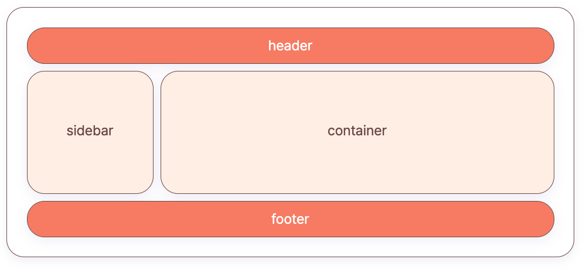

Grid 안의 아이템들도 또다시 grid 레이아웃으로 만드는게 가능하다. 아주 작은 텍스트 단위의 요소도 grid를 사용하여 아이템을 배치할 수 있다.

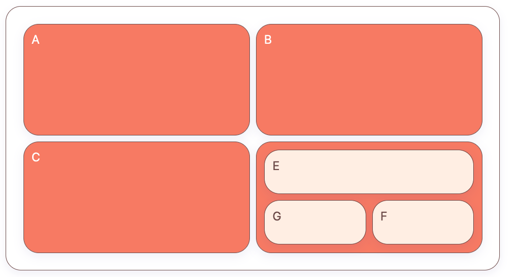

Grid 레이아웃으로 쉽게 만들 수 있는 홈페이지의 예이다. 헤더-사이드바-컨테이너로 구성되어 있고, 컨테이너 안의 아이템들도 grid를 사용한 것을 확인할 수 있다.


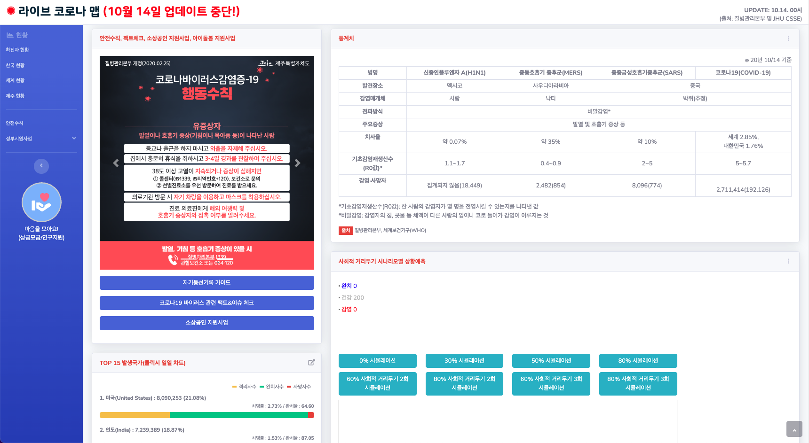

## 1.2. grid의 대표적인 구성요소


- **그리드 컨테이너 (Grid Container)**
  - grid를 적용하는 전체 영역을 의미. 열(Columns)과 행(Rows)을 가지며, 그리드 아이템(Items)을 배치
- **그리드 아이템 (Grid** **Item)**
  - grid 컨테이너의 자식 요소들,이 아이템들이 grid 규칙에 의해 배치
- **그리드 라인(Grid Line)**
  - grid를 그리는 행(Row)/열(Column)을 그리는 선
  - 각 선은 라인 넘버를 가지며 그리드 아이템을 배치하는 기준이 된다.
- **그리드 트랙 (Grid Track)**
  - grid 라인 사이의 행(Row) 또는 열(Column) 공간
- **그리드 셀 (grid Cell)**
  - grid의 한 칸을 가리키는 말 (유닛으로 부르기도 한다)
  - 4개의 그리드 라인이 모여 그려지는 한 칸의 공간
- **그리드 번호(Grid Number)**
  - grid 라인의 각 번호
- **그리드 영역(Grid Area)**
  - 4개의 그리드 라인으로 둘러싸인 공간으로 그리드 셀이 묶인 영역
  - 식별자를 통해 요소를 배치
- **그리드 갭(Grid Gap)**
  - 그리드 거터(Grid Gutters)
  - 행(Row) 또는 열(Column) 사이의 간격

## 1.3. 개발자 도구로 그리드 체크하는법

Chrome에서 개발자 도구를 이용하면 HTML 요소에 grid 속성이 적용된 요소는 옆에 버튼이 생기게 되는데 이 버튼을 누르고 닫음으로써 grid 요소의 배치, 속성, 크기를 파악할 수 있다.

맥은 `<command + option + i>`, 윈도우는 `<ctrl + shift + i>` 또는 F12를 이용하여 개발자 도구로 진입할 수 있다.

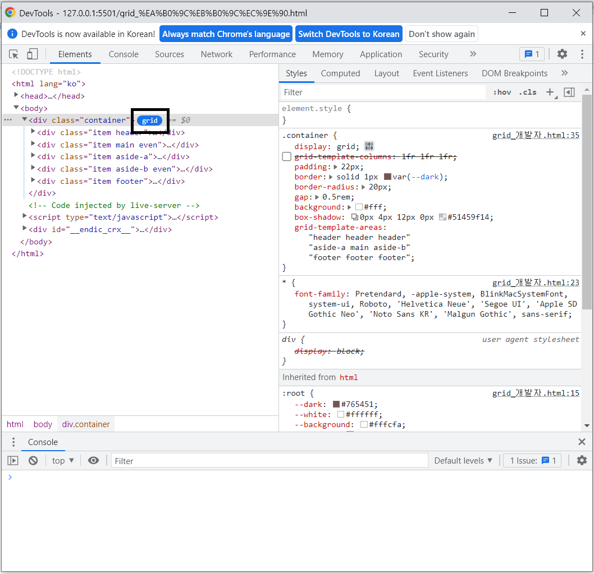


또한, Styles 탭에서 `display : grid;` 속성 옆의 버튼을 이용해서 요소에 grid의 다양한 속성을 바로 적용하여 어떻게 변하는지 바로 확인할 수 있다.


Styles 탭 옆의 Layout 탭에 들어가게 되면 그리드가 적용된 요소를 더욱 상세하게 볼 수 있다.

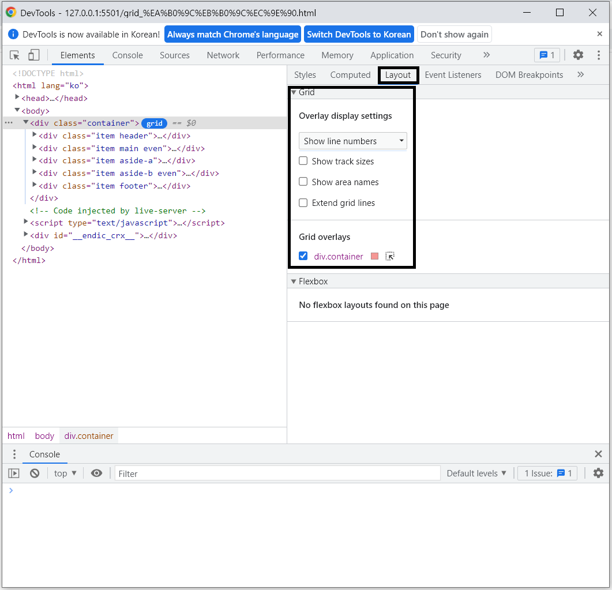

**Show track sizes :** 그리드 셀(Grid Cell)의 크기를 표시한다.

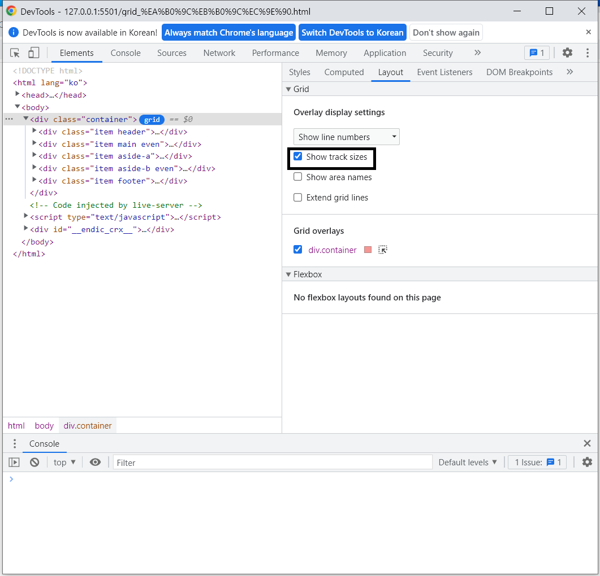

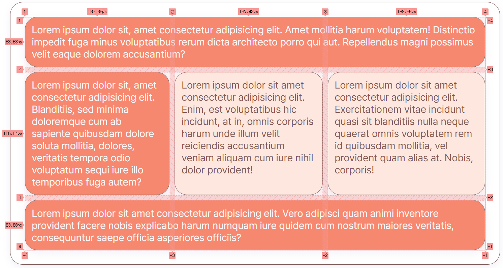

**Show area names : `grid-template-areas`** 속성이 적용되어 있다면, 그 영역의 이름을 표시한다.

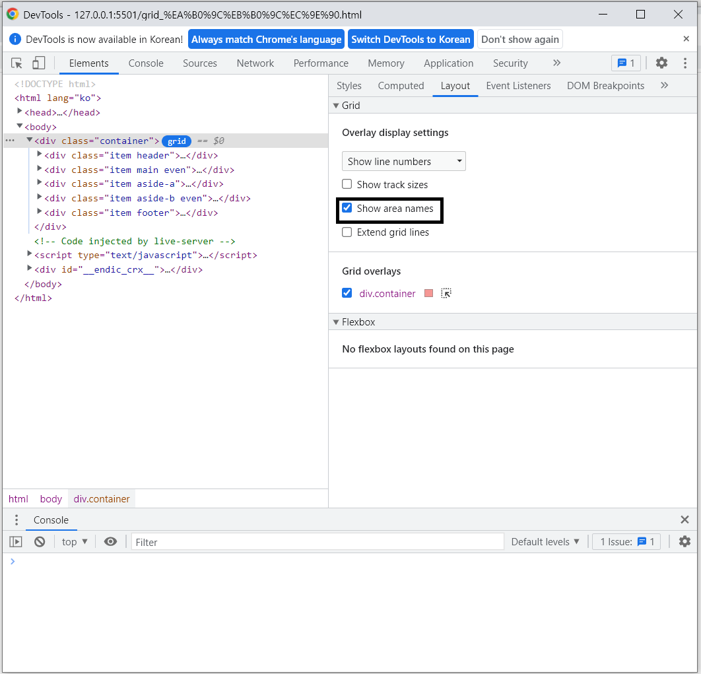

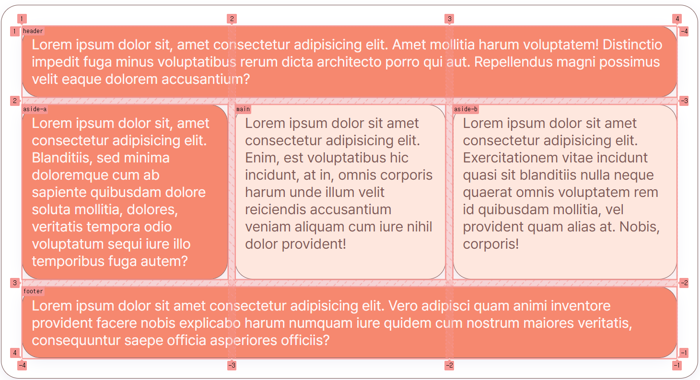

**Extend grid lines :** 그리드 라인(Grid Line)을 확장한다.

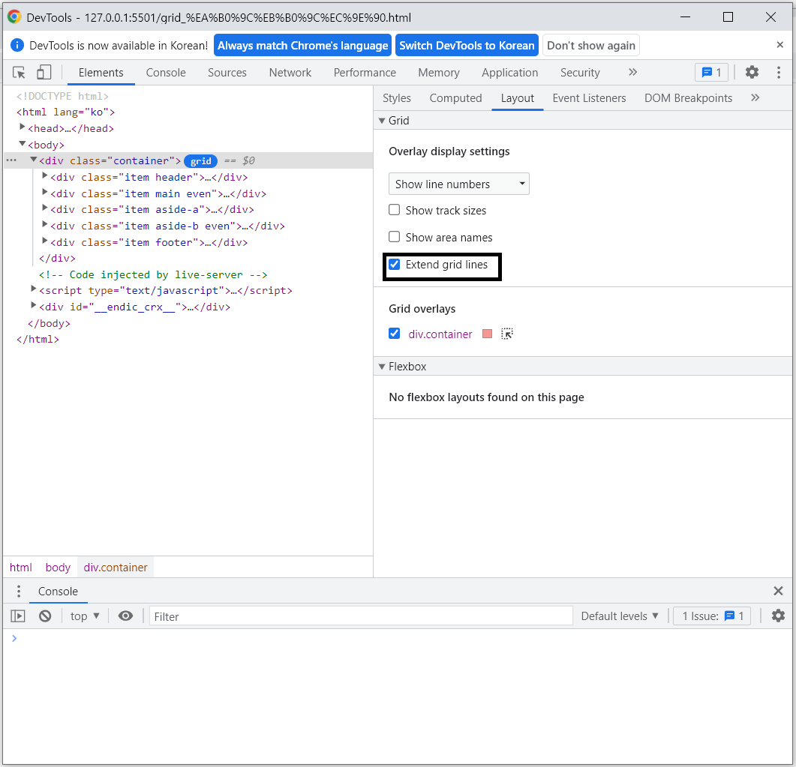

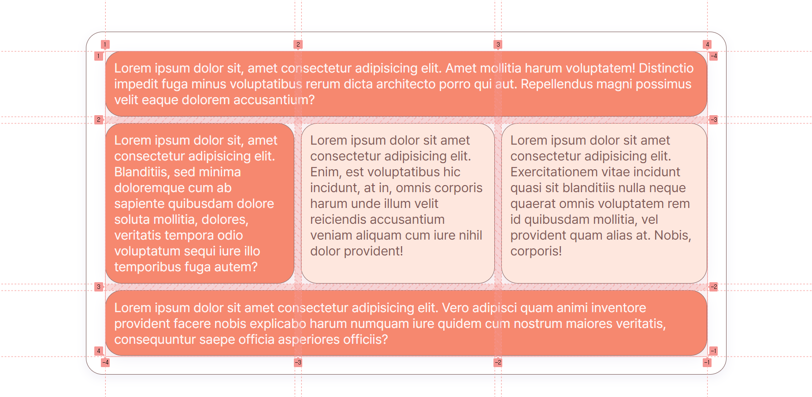

## 1.4. grid 사용법

Grid는 Flex와 마찬가지로 HTML 구조에 컨테이너와 아이템, 이렇게 두 가지 요소가 필요하다. 컨테이너는 부모 요소로, Grid 레이아웃의 영향을 받는 전체적인 공간이다. 반면 아이템은 자식 요소로, 컨테이너 내부에서 설정된 속성에 따라 배치된다. 이를 Grid에서는 각각 그리드 컨테이너(Grid Container)와 그리드 아이템(Grid Item)이라 한다.

```html
<div class="container">
  <div class="item"></div>
  <div class="item"></div>
  <div class="item"></div>
</div>
```

grid를 사용하기 위해선 flex 처럼 CSS에서 display 속성을 부여하는 과정이 필요하다. 컨테이너`display:grid;`를 적용하면 이후 Grid가 제공하는 속성을 다양하게 사용할 수 있다.

선언 시 즉각적으로 아이템들이 가로로 배치되는 flex와 달리, grid는 `display:grid;`선언을 해도 변화를 확인하기 어렵다. 왜냐하면 grid 레이아웃이 되었지만, 아직 컨테이너가 하나의 열(row)밖에 없어 아이템들이 기본정렬을 유지하고 있기 때문이다. 컨테이너에 grid-template-columns, grid-template-rows 속성을 추가하여 행과 열을 추가함으로써 그리드 형태를 명확히 확인할 수 있다.

```css
.container {
  display: grid;
}
```

# 2. Grid row , Grid column

## 2.1. grid-template-rows, grid-template-columns

Grid는 행과 열로 이루어져 있다. 행은 row, ‘가로'이고 열은 column, '세로'이다. grid row와 column을 사용하기 위해서는 template 속성을 사용해 행과 열의 크기를 지정해 주어야 한다. 여기서 주의할 점은 행과 열의 **개수**가 아닌 **크기를** 지정하는 것이다.

- `grid-template-columns` : column(열)의 넓이(크기) 지정하기
- `grid-template-rows` : row(행)의 높이 지정하기

```css
grid-template-columns: colum1넓이 colum2넓이;
grid-template-rows: row1높이 row2높이;
```

```editor
<div data-mode="snippet" class="fg-editor css-grid theme-grid">
  <code data-hidden="true">
    .item {
      width: auto;
      height: auto;
    }
  </code>
  <code data-item="4">
    .container {
      display: grid;
      grid-template-columns: 200px 200px;
      grid-template-rows: 100px 100px;
    }
  </code>
</div>
```

## 2.2. repeat / 1fr이란

**fr이란?**

fr 은 fraction의 줄임말로, fraction을 직역하면 ‘분수’라는 뜻을 가지고 있다. grid 에서는 그리드 컨테이너에서 사용할 수 있는 공간의 일부를 나타내는 단위를 의미하는데, fr 단위를 사용하면 그리드 내부의 레이아웃 분할을 자동으로 계산해서 적용할 수 있다. 그리드 레이아웃에서 그리드 아이템의 크기를 지정할 때 px 을 이용하면 항상 크기가 고정되기 때문에 반응형 웹 디자인에는 적합하지 않다. 그래서 상대적인 크기를 지정할 수 있도록 fr 단위를 사용하면, 더 편리하게 반응형 디자인을 적용할 수 있다. 예를 들어 `grid-template-columns: 1fr 1fr 1fr;` 이라는 코드를 적는다면, 컨테이너 안 그리드 아이템의 크기는 1 : 1 : 1 의 비율로 각각 적용된다.

```editor
<div data-mode="snippet" class="fg-editor css-grid theme-grid">
  <code data-hidden="true">
    .item {
      width: auto;
      height: auto;
    }
  </code>
  <code>
    .container {
      display: grid;
      grid-template-columns: 1fr 1fr 1fr;
    }
  </code>
</div>
```

**repeat() 함수**

repeat()은 그리드 속성값으로 사용할 수 있는 함수로, 반복되는 값을 자동으로 처리할 수 있다. 만약, 스타일 중 반복되는 부분이 있다면 repeat() 함수를 이용해서 코드를 좀 더 간소화할 수 있다.

**적용방법**

```css
repeat(반복횟수, 반복값);
```

```editor
<div data-mode="snippet" class="fg-editor css-grid theme-grid">
  <code data-hidden="true">
    .item {
      width: auto;
      height: auto;
    }
  </code>
  <code>
    .container {
      display: grid;
      grid-template-columns: repeat(3, 1fr);
    }
  </code>
</div>
```

## 2.3. min-max 함수

min-max속성은 트랙의 크기를 최솟값과 최댓값으로 지정할 수 있는 함수를 의미한다. 그리드 열 또는 행의 값으로 minmax를 사용할 수 있다. minmax( 트랙의 최솟값, 트랙의 최댓값) 형태로 사용한다.

**자주 쓰이는 속성**

- length: 음수의 아닌 길이값이다.
- percentage: 그리드 컨테이너의 블록 크기에 상대적인 음이 아닌 백분율이다.
- flex: 그리드 트랙을 숫자의 비율대로 나눈다.
- max-content: 그리드 트랙을 차지하는 최대 콘텐츠 범위이다.
- min-content: 그리드 트랙을 차지하는 최소 콘텐츠 범위이다.
- auto: 그리드 트랙을 차지하는 최대 콘텐츠 범위이다. (max-content 결과와 동일하다.)

grid-template-columns의 영역을 px 단위로 열의 너비를 설정할 수 있다. 화면 전체 크기를 변경하면 동시에 열의 너비가 늘어나거나 줄어들기도 한다. 아래 예시는 최소 30px에서 최대 100px사이에서만 반응한다.

```editor
<div data-mode="snippet" class="fg-editor css-grid theme-grid">
  <code data-hidden="true">
    .item {
      width: auto;
      height: auto;
    }
    .container {
      padding: 10px;
      border: 3px solid var(--gray-8);
      border-radius: 16px;
    }
  </code>
  </code>
  <code data-snippet="min">
    .container {
      display: grid;
      grid-template-columns: repeat(3, minmax(30px, 100px));
      width: 100px;
    }
  </code>
  <code data-snippet="max">
    .container {
      display: grid;
      grid-template-columns: repeat(3, minmax(30px, 100px));
      width: 400px;
    }
  </code>
</div>
```

grid-template-columns의 영역을 % 단위와 fr 단위로 열의 너비를 설정할 수 있다. 아래 예시는 첫 번째 열의 너비가 최소 50%에서 최대 90% 비율로 늘어나며 두 번째 세 번째 열은 나머지 공간을 균등하게 나누어 가진다.

```editor
<div data-mode="snippet" class="fg-editor css-grid theme-grid">
  <code data-hidden="true">
    .item {
      width: auto;
      height: auto;
    }
  </code>
  </code>
  <code>
    .container {
      display: grid;
      grid-template-columns: minmax(50%, 90%) 1fr 1fr;
    }
  </code>
</div>
```

max 값을 auto로 입력하면 그리드 영역 범위를 최대 크기의 영역으로 유연하게 늘어나도록 할 수 있다.

```editor
<div data-mode="snippet" class="fg-editor css-grid theme-grid">
  <code data-hidden="true">
    .item {
      width: auto;
      height: auto;
    }
    .container {
      padding: 10px;
      border: 3px solid var(--gray-8);
      border-radius: 16px;
    }
  </code>
  </code>
  <code data-snippet="min">
    .container {
      display: grid;
      grid-template-columns: repeat(3, minmax(30px, auto));
      width: 100px;
    }
  </code>
  <code data-snippet="max">
    .container {
      display: grid;
      grid-template-columns: repeat(3, minmax(30px, auto));
      width: 400px;
    }
  </code>
</div>
```

minmax(auto, max-content)를 사용하면 그리드 아이템 콘텐츠 크기에 맞추어 영역이 설정된다.

```editor
<div data-mode="snippet" class="fg-editor css-grid theme-grid">
  <code data-hidden-text="true">
    AA
    BBBB
    CCCCCC
  </code>
  <code data-hidden="true">
    .item {
      width: auto;
      height: auto;
    }
  </code>
  </code>
  <code data-snippet="px">
    .container {
      display: grid;
      grid-template-columns: repeat(3, minmax(100px, 200px));
    }
  </code>
  <code data-snippet="max-content">
    .container {
      display: grid;
      grid-template-columns: repeat(3, minmax(auto, max-content));
    }
  </code>
</div>
```

auto-fill과 사용하여 반응형 그리드 영역을 만들 수 있다. minmax를 사용하여 최소 100px의 영역을 유지하고 1fr의 길이는 전체 너비의 따라 반응한다. auto-fill은 설정된 너비에서 가능한 많은 영역을 만들어낸다.

```editor
<div data-mode="snippet" class="fg-editor css-grid theme-grid">
  <code data-hidden="true">
    .item {
      width: auto;
      height: auto;
    }
  </code>
  </code>
  <code data-snippet="반복횟수" data-item="8">
    .container {
      display: grid;
      grid-template-columns: repeat(3, minmax(100px, 1fr));
    }
  </code>
  <code data-snippet="auto-fill" data-item="8">
    .container {
      display: grid;
      grid-template-columns: repeat(auto-fill, minmax(100px, 1fr));
    }
  </code>
</div>
```

## 2.4. grid-auto-rows , grid-auto-columns

grid-item이 사용자가 명시적으로 지정해준 grid-template-columns 또는 grid-template-rows 에서 벗어난 위치에 존재하게 될 때, 트랙의 크기를 암시적으로 지정하는 속성이다. 쉽게 말하자면, grid 행(rows)/열(columns) 트랙 크기를 자동으로 설정한다.

**grid-auto-rows**

grid item이 grid-template-rows로 지정한 명시적 행 외부에 존재하는 경우 암시적 행의 크기가 적용된다. 앞으로 추가될 수 있는 모든 행의 높이를 정해주고 싶다면 grid-auto-rows를 적용해주면 된다.

**grid-auto-columns**

grid item이 grid-template-columns로 지정한 명시적 열 외부에 존재하는 경우 암시적 열의 크기가 적용된다. 암시적 크기가 적용된 행과 열은 오직 양수만 사용할 수 있다 (음수는 사용이 불가하다)

기본적으로 grid에서 각 행의 높이는 지정해주지 않는 이상 콘텐츠의 크기를 가지기 때문에 각각 다르다.

```editor
<div data-mode="snippet" class="fg-editor css-grid theme-grid">
  <code data-hidden-text="true">
    grid\ngrid\ngrid
    grid
    grid
    grid
    grid
    grid
  </code>
  <code data-hidden="true">
    .item {
      width: auto;
      height: auto;
      text-align: center;
    }
  </code>
  </code>
  <code data-item="6">
    .container {
      display: grid;
      grid-template-columns: 1fr 1fr 1fr;
    }
  </code>
</div>
```

각 행의 높이를 같게 만들기 위해서 grid-template-row 속성을 이용해 여러 가지 방식으로 높이 값을 지정해줄 수 있지만, 이 높이 값은 ‘앞으로 추가될 아이템'에는 적용되지 않는다. grid-template-rows는 현재 정의되고 있는 행의 높이만을 설정할 뿐이기 때문이다. 아이템이 더 추가된다면 행의 높이가 달라지고, 그럼 grid-template-rows를 다시 한번 수정해야 한다는 번거로움이 있다.

```editor
<div data-mode="snippet" class="fg-editor css-grid theme-grid">
  <code data-hidden-text="true">
    grid\ngrid\ngrid
    grid
    grid
    grid
    grid
    grid
    grid
    grid
    grid
  </code>
  <code data-hidden="true">
    .item {
      width: auto;
      height: auto;
      text-align: center;
    }
  </code>
  </code>
  <code data-item="9">
    .container {
      display: grid;
      grid-template-columns: 1fr 1fr 1fr;
      grid-template-rows: 1fr 1fr;
    }
  </code>
</div>
```

이 문제를 해결하기 위해 grid-auto-rows를 써주면 콘텐츠가 늘어날 때마다 CSS에 row의 개수를 수정해 줄 필요 없이 자동으로 값이 적용되게 된다.

```editor
<div data-mode="snippet" class="fg-editor css-grid theme-grid">
  <code data-hidden-text="true">
    grid\ngrid\ngrid
    grid
    grid
    grid
    grid
    grid
    grid
    grid
    grid
  </code>
  <code data-hidden="true">
    .item {
      width: auto;
      height: auto;
      text-align: center;
    }
  </code>
  </code>
  <code data-item="9">
    .container {
      display: grid;
      grid-template-columns: 1fr 1fr 1fr;
      grid-auto-rows: 1fr;
    }
  </code>
</div>
```

minmax 프로퍼티를 사용하여 값을 지정해줄 수도 있다.

```editor
<div data-mode="snippet" class="fg-editor css-grid theme-grid">
  <code data-hidden-text="true">
    grid\ngrid\ngrid
    grid
    grid
    grid
    grid
    grid
    grid
    grid
    grid
  </code>
  <code data-hidden="true">
    .item {
      width: auto;
      height: auto;
      text-align: center;
    }
  </code>
  </code>
  <code data-item="9">
    .container {
      display: grid;
      grid-template-columns: 1fr 1fr 1fr;
      grid-auto-rows: minmax(100px, auto);
    }
  </code>
</div>
```

# 3. Gap

## 3.1. gap이란?

Gap은 그리드 컨테이너와 아이템 요소들의 간격을 설정하는 속성이다. gap 속성값에는 우리가 사용하는 각종 단위가 들어갈 수 있다. 길이를 나타내는 단위인 em, rem, px, vmin , vmax나 퍼센티지(%)를 사용 가능하며, calc() 함수를 이용하여 계산된 값도 사용할 수 있다. 하지만 fr 단위는 사용이 불가하다는 점에 주의해야 한다.

```css
/*단일 길이값*/
gap: 10px;
gap: 1em;
gap: 3vmin;

/*단일 퍼센티지값*/
gap: 10%;

/*이중 값*/
gap: 20px 10px;
gap: 10% 20%;

/*calc() 값*/
gap: calc(20px+10%);
```

```editor
<div data-mode="snippet" class="fg-editor css-grid theme-grid">
  <code data-hidden="true">
    .container {
      gap: 0;
    }
    .item {
      width: auto;
      height: auto;
    }
  </code>
  <code data-snippet="0px" data-item="9">
    .container {
      display: grid;
      grid-template-columns: repeat(3, 1fr);
      gap: 0px;
    }
  </code>
  <code data-snippet="20px" data-item="9">
    .container {
      display: grid;
      grid-template-columns: repeat(3, 1fr);
      gap: 20px;
    }
  </code>
  <code data-snippet="10%" data-item="9">
    .container {
      display: grid;
      grid-template-columns: repeat(3, 1fr);
      gap: 10%;
    }
  </code>
  <code data-snippet="20px 10px" data-item="9">
    .container {
      display: grid;
      grid-template-columns: repeat(3, 1fr);
      gap: 20px 10px;
    }
  </code>
  <code data-snippet="20% 10%" data-item="9">
    .container {
      display: grid;
      grid-template-columns: repeat(3, 1fr);
      gap: 20% 10%;
    }
  </code>
</div>
```

fr 단위가 gap의 속성값이 될 수 없는 이유는, fr은 사용 가능한 공간을 분배하는 단위이기 때문이다. 아래 예시처럼 `grid-template-columns: 1fr 1fr 1fr;` 라는 속성을 컨테이너에 적용하면, 컨테이너의 사용 가능한 넓이를 고려하여 1 : 1 : 1의 비율로 분배하는 것이 fr의 역할이다. 하지만, grid item 요소들 사이에는 \***\*사용 가능한 공간이 존재하지 않고, 서로 붙어있는 상태이다**.** 따라서 \*\***아이템 간의 간격을 벌리는 속성인 gap에 fr 단위가 적용되지 않는 것이다.

아래 예제는 `gap:2fr`을 그리드 컨테이너에 부여하였지만 적용되지 않는 모습이며, 개발자 도구에서도 마찬가지로 fr이 잘못된 속성값이라 표시되는 것을 확인할 수 있다.


## 3.2. margin과 gap의 차이점

margin의 경우 인접한 요소의 존재와 상관없이 스타일이 적용되 불필요한 공간을 만든다.


gap은 인접한 요소가 있을때만 사이에 공간을 만들어 불필요한 공간을 만들지 않는다.

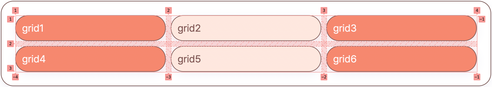

## 3.3. gap의 종류

**row-gap**

grid 셀의 행 사이의 간격을 설정하는 속성이다.

```editor
<div data-mode="snippet" class="fg-editor css-grid theme-grid">
  <code data-hidden="true">
    .container {
      gap: 0;
    }
    .item {
      width: auto;
      height: auto;
    }
  </code>
  <code data-item="6">
    .container {
      display: grid;
      grid-template-columns: repeat(3, 1fr);
      row-gap: 10px;
    }
  </code>
</div>
```

**column-gap**

grid 셀의 열 사이의 간격을 설정하는 속성이다.

```editor
<div data-mode="snippet" class="fg-editor css-grid theme-grid">
  <code data-hidden="true">
    .container {
      gap: 0;
    }
    .item {
      width: auto;
      height: auto;
    }
  </code>
  <code data-item="6">
    .container {
      display: grid;
      grid-template-columns: repeat(3, 1fr);
      column-gap: 10px;
    }
  </code>
</div>
```

**gap**

`grid-row-gap`과 `grid-column-gap`을 한 번에 작성할 수 있는 축약형이다.

1**) gap 단일 값**

하나의 값으로 축약하여 row-gap과 column-gap을 동시에 같은 크기의 gap을 만들 수 있다. 사용이 편리하지만 row와 column에 각자 다른 크기나 단위를 지정할 수는 없다.

```editor
<div data-mode="snippet" class="fg-editor css-grid theme-grid">
  <code data-hidden="true">
    .container {
      gap: 0;
    }
    .item {
      width: auto;
      height: auto;
    }
  </code>
  <code data-item="6">
    .container {
      display: grid;
      grid-template-columns: repeat(3, 1fr);
      gap: 10px;
    }
  </code>
</div>
```

**2) gap 이중값**

gap에 부여하는 첫 번째 값은 row-gap, 두 번째 값은 column-gap이다. 각자 다른 크기와 단위를 섞어서 사용할 수 있다. 만약, row와 column에 같은 크기의 gap을 주고 싶다면 gap 단일 값을 사용하는 동시에 적용하는 것이 더 효율적이다.

```editor
<div data-mode="snippet" class="fg-editor css-grid theme-grid">
  <code data-hidden="true">
    .container {
      gap: 0;
    }
    .item {
      width: auto;
      height: auto;
    }
  </code>
  <code data-snippet="40px 10px" data-item="6">
    .container {
      display: grid;
      grid-template-columns: repeat(3, 1fr);
      gap: 40px 10px;
    }
  </code>
  <code data-snippet="10px 40px" data-item="6">
    .container {
      display: grid;
      grid-template-columns: repeat(3, 1fr);
      gap: 10px 40px;
    }
  </code>
</div>
```

# 4. 각 셀의 영역 지정

## 4.1. grid-column-start & grid-column-end

Grid 레이아웃에는 암묵적으로 grid 라인이 포함되어 있다. column 2개로 이루어진 grid 레이아웃을 상상해보도록 하겠다. column 라인은 앞에서부터 차례로 1,2,3번을 매길 수 있으므로 총 3개다.

- grid-column-start : column(열)시작의 라인 번호를 지정해준다.
- grid-column-end : column(열) 마지막의 라인 번호를 지정해준다.


```editor
<div data-mode="snippet" class="fg-editor css-grid theme-grid">
  <code data-hidden="true">
    .item {
      width: auto;
      height: auto;
    }
  </code>
  <code>
    .container {
      display: grid;
      grid-template-columns: 1fr 1fr;
    }
    .item1 {
      grid-column-start: 1;
      grid-column-end: 3;
    }
  </code>
</div>
```

Grid 레이아웃에는 암묵적으로 grid 라인이 포함되어 있다. column 2개로 이루어진 grid 레이아웃을 상상해보도록 하겠다. column 라인은 앞에서부터 차례로 1,2,3번을 매길 수 있으므로 총 3개다.

## 4.2. grid-row-start & grid-row-end

다음은 grid-row-start & grid-row-end에 대해 알아보자. column과 사용 방법은 똑같으며 row의 영역을 지정할 수 있는 속성이다.

- grid-row-start : row의 시작 위치를 지정해준다.
- grid-row-end : row의 끝 위치를 지정해준다.

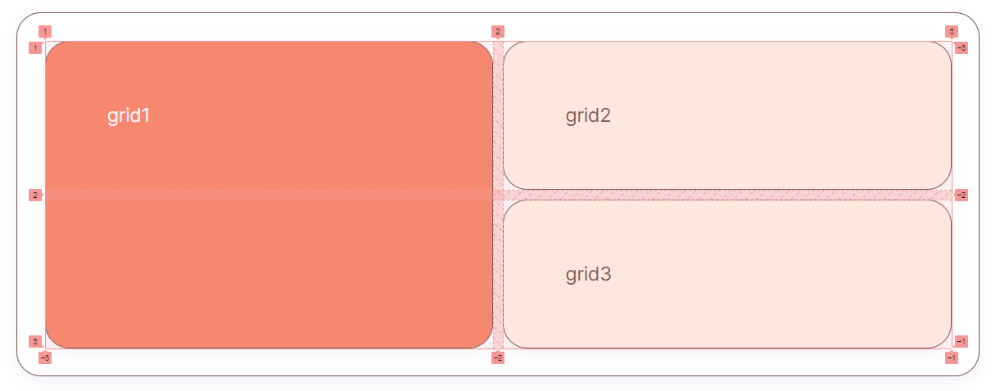

```editor
<div data-mode="snippet" class="fg-editor css-grid theme-grid">
  <code data-hidden="true">
    .item {
      width: auto;
      height: auto;
    }
  </code>
  <code>
    .container {
      display: grid;
      grid-template-columns: 1fr 1fr;
    }
    .item1 {
      grid-row-start: 1;
      grid-row-end: 3;
    }
  </code>
</div>
```

위 예제에서 grid1의 row 영역이 grid line의 1부터 3 까지 차지한 것을 볼 수 있다.

## 4.3. 셀의 영역 지정

```editor
<div data-mode="snippet" data-hide-buttons="true" class="fg-editor css-grid theme-grid">
  <code data-hidden-text="true">
    grid1
    grid2
    grid3
    grid4
    grid5
    grid6
    grid7
  </code>
  <code data-hidden="true">
    .item {
      width: auto;
      height: auto;
    }
    .item {
      background-color: var(--primary-3);
    }
    .item1, .item2 {
      background-color: var(--primary-5);
    }
  </code>
  <code data-item="7">
    .container {
      display: grid;
      grid-template-columns: 1fr 1fr 1fr;
      grid-template-rows: 1fr 1fr;
    }
  </code>
</div>
```

위 예제의 grid1 과 grid2의 영역을 지정해보겠다.

```editor
<div data-mode="snippet" data-hide-buttons="true" class="fg-editor css-grid theme-grid">
  <code data-hidden-text="true">
    grid1
    grid2
    grid3
    grid4
    grid5
    grid6
    grid7
  </code>
  <code data-hidden="true">
    .item {
      width: auto;
      height: auto;
    }
    .item {
      background-color: var(--primary-3);
    }
    .item1, .item2 {
      background-color: var(--primary-5);
    }
  </code>
  <code data-item="7">
    .container {
      display: grid;
      grid-template-columns: 1fr 1fr 1fr;
      grid-template-rows: 1fr 1fr;
    }
    .item1 {
      grid-column-start: 2;
      grid-column-end: 3;
      grid-row-start: 1;
      grid-row-end: 3;
    }
    .item2 {
      grid-column-start: 1;
      grid-column-end: 3;
      grid-row-start: 3;
      grid-row-end: 4;
    }
  </code>
</div>
```

지금까지 배운 `grid-column-start` , `grid-column-end` , `grid-row-start` , `grid-row-end` 속성을 사용하여 grid 셀의 영역을 지정할 수 있다. 하지만 이렇게 column과 row에 start와 end를 각 각 지정해주기에는 코드가 너무 길어지게 된다. start와 end를 한번에 지정 하려면 start와 end의 축약 속성인 `grid-column` , `grid-row`를 사용할 수 있다.

## 4.4. grid-column & grid-row

위에서 배운 `grid-column-start`와 `grid-column-end` 는 `grid-column`으로, `grid-row-start`와 `grid-row-end`는 `grid-row`로 축약하여 start와 end를 한 번에 지정하여 사용할 수 있다.

- grid-column : 시작 / 끝 ;
- grid-row : 시작 / 끝 ;

```editor
<div data-mode="snippet" data-hide-buttons="true" class="fg-editor css-grid theme-grid">
  <code data-hidden-text="true">
    grid1
    grid2
    grid3
    grid4
    grid5
    grid6
    grid7
  </code>
  <code data-hidden="true">
    .item {
      width: auto;
      height: auto;
    }
    .item {
      background-color: var(--primary-3);
    }
    .item1, .item2 {
      background-color: var(--primary-5);
    }
  </code>
  <code data-item="7">
    .container {
      display: grid;
      grid-template-columns: 1fr 1fr 1fr;
      grid-template-rows: 1fr 1fr;
    }
    .item1 {
      grid-column: 2 / 3;
      grid-row: 1 / 3;
    }
    .item2 {
      grid-column: 1 / 3;
      grid-row: 3 / 4;
    }
  </code>
</div>
```

이렇게 grid-column, grid-row 속성을 사용하여 start와 end를 한 줄의 코드로 줄여 쓸 수 있게 되었다. 여기서 column과 row까지 한 번에 사용하고 싶다면 `grid-area` 속성을 사용하면 된다.

## 4.5. span 을 이용한 레이아웃 지정

Grid 에서 span은 아이템 요소에 쓰이는 속성이며, 몇개의 셀을 차지하게 할 것인지 지정해줄 수 있다. 숫자와 함께 쓰이며 이 숫자만큼 영역을 차지한다. 명시하지 않으면 span 1이 기본값이 된다.

```editor
<div data-mode="snippet" data-hide-buttons="true" class="fg-editor css-grid theme-grid">
  <code data-hidden-text="true">
    grid1
    grid2
    grid3
    grid4
    grid5
    grid6
    grid7
  </code>
  <code data-hidden="true">
    .item {
      width: auto;
      height: auto;
    }
    .item {
      background-color: var(--primary-3);
    }
    .item1, .item2 {
      background-color: var(--primary-5);
    }
  </code>
  <code data-item="7">
    .container {
      display: grid;
      grid-template-columns: 1fr 1fr 1fr;
      grid-template-rows: 1fr 1fr;
    }
    .item1 {
      grid-column: 2 / 1 span;
      grid-row: 1 / 2 span;
    }
    .item2 {
      grid-column: 1 / 2 span;
      grid-row: 3 / 1 span;
    }
  </code>
</div>
```

## 4.6. grid-area

**실행코드**

grid 컨테이너 내의 item에 적용하는 속성이며, 아이템을 그리드에 배치할 때 사용할 수 있는 방법의 하나이다.

- `grid-row-start`, `grid-column-start`, `grid-row-end`, `grid-column-end`의 단축 속성이며, column과 row를 한 번에 지정할 수 있는 장점이 있다.
- 형태: grid-area: grid-row-start / grid-column-start / grid-row-end / grid- column-end
- 아래 예시의 grid1의 grid-area는 grid-row: 1 / 3, grid-column: 2 / 3과 동일하다.
- 아래 예시의 grid2의 grid-area는 grid-row: 3 / 4, grid-column: 1 / 3과 동일하다.

```editor
<div data-mode="snippet" data-hide-buttons="true" class="fg-editor css-grid theme-grid">
  <code data-hidden-text="true">
    grid1
    grid2
    grid3
    grid4
    grid5
    grid6
    grid7
  </code>
  <code data-hidden="true">
    .item {
      width: auto;
      height: auto;
    }
    .item {
      background-color: var(--primary-3);
    }
    .item1, .item2 {
      background-color: var(--primary-5);
    }
  </code>
  <code data-item="7">
    .container {
      display: grid;
      grid-template-columns: 1fr 1fr 1fr;
      grid-template-rows: 1fr 1fr;
    }
    .item1 {
      grid-area: 1 / 2 / 3 / 3;
    }
    .item2 {
      grid-area: 3 / 1 / 4 / 3;
    }
  </code>
</div>
```

## 4.7. grid-template-areas

**실행코드**

`grid-template-area` 는 그리드 내 각 영역(Grid Area)에 이름을 붙여 배치하는 매우 직관적인 방법이다.

각각의 아이템 요소가 차지하는 셀의 개수만큼 원하는 위치에 이름을 적어 영역을 지정해주면 지정한 자리만큼의 셀을 차지한다.


```editor
<div data-mode="snippet" data-hide-buttons="true" class="fg-editor css-grid theme-grid">
  <code data-hidden-text="true">
    header
    main
    sidebar
    footer
  </code>
  <code data-hidden="true">
    .item {
      width: auto;
      min-height: 80px;
      height: auto;
    }
    .item3, .item4 {
      background-color: var(--primary-2);
      color: var(--primary-6);
    }
  </code>
  <code data-item="4">
    .container {
      display: grid;
      grid-template-columns: repeat(5, 1fr);
      grid-template-rows: repeat(3, 1fr);
      grid-template-areas:
        "header header header header header"
        "main main main side side"
        "footer footer footer footer footer";
    }
    .item1 {
      grid-area: header;
    }
    .item2 {
      grid-area: main;
    }
    .item3 {
      grid-area: side;
    }
    .item4 {
      grid-area: footer;
    }
  </code>
</div>
```

- 각 아이템의 구분은 공백으로 하며 빈 영역을 만들고 싶다면 `.` (마침표)와 `none` 으로 빈 영역을 표시해줄 수 있다.

## 4.8. grid line 외의 추가적인 방법

**Grid name을 이용한 레이아웃 지정**

**실행코드**

그리드 라인은 암묵적으로 그리드 라인 숫자가 지정되어 있는데, 이 라인에 이름을 지정할 수 있다.

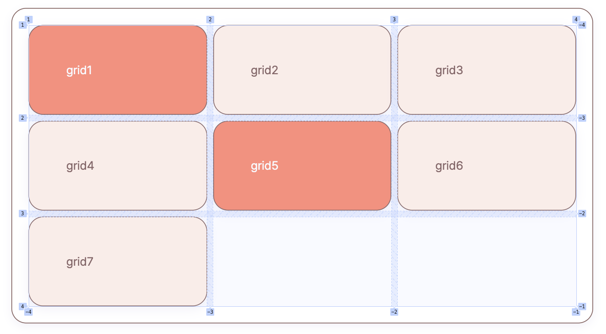

```css
.container {
  display: grid;
  grid-template-columns: [col-1] 1fr [col-2] 1fr [col-3] 1fr [col-4];
  /* grid-template-columns: 1fr 1fr 1fr 과 같다. */
  grid-template-rows: [row-1] 1fr [row-2] 1fr [row-3] 1fr [row-4];
  /* grid-template-rows: 1fr 1fr 1fr 과 같다. */
}
```

각각의 라인에 이름을 정해주고 이 이름을 각 아이템 요소의 `grid-column-start` , `grid-column-end` , `grid-row-start` , `grid-row-end` 속성에 지정해주면 된다.

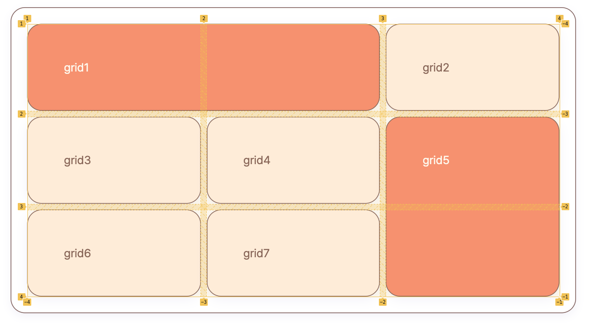

```editor
<div data-mode="snippet" data-hide-buttons="true" class="fg-editor css-grid theme-grid">
  <code data-hidden-text="true">
    grid1
    grid2
    grid3
    grid4
    grid5
    grid6
    grid7
  </code>
  <code data-hidden="true">
    .item {
      width: auto;
      min-height: 80px;
      height: auto;
    }
    .item {
      background-color: var(--primary-2);
      color: var(--primary-6);
    }
    .item1, .item5 {
      background-color: var(--primary-5);
      color: var(--white);
    }
  </code>
  <code data-item="7">
    .container {
      display: grid;
      grid-template-columns: [col-1] 1fr [col-2] 1fr [col-3] 1fr [col-4];
      grid-template-rows: [row-1] 1fr [row-2] 1fr [row-3] 1fr [row-4];
    }
    .item1 {
      grid-row-start: row-1;
      grid-row-end: row-1;
      grid-column-start: col-1;
      grid-column-end: col-3;
    }
    .item5 {
      grid-row-start: row-2;
      grid-row-end: row-4;
      grid-column-start: col-3;
      grid-column-end: col-4;
    }
  </code>
</div>
```

쉽게 생각하면 숫자 대신 이름을 넣어준다고 보면 된다.

# 5. IE지원을 위한 Grid

**아래와 같이 -ms-prefix를 붙여 IE지원을 해줄 수 있다.**

- `display: grid` → `display: -ms-grid`
- `grid-template-rows` → `-ms-grid-rows`
- `grid-template-columns` → `-ms-grid-columns`

**repeat()속성은 다음과 같이 사용한다.**

- `repeat(12, 1fr 20px)` → `(1fr 20px)[12]`

**grid 속성 IE지원 대응표**

| 속성                                     | IE 지원               |
| ---------------------------------------- | --------------------- |
| display: grid;                           | display: -ms-grid;    |
| grid-template-rows                       | -ms-grid-rows         |
| grid-template-columns                    | -ms-grid-columns      |
| grid-row-start                           | -ms-grid-row          |
| grid-column-start                        | -ms-grid-column       |
| align-self                               | -ms-grid-row-align    |
| justify-self                             | -ms-grid-column-align |
| grid-row: 1 / span 2;에서 span 2 대신    | -ms-grid-row-span     |
| grid-column: 1 / span 2;에서 span 2 대신 | -ms-grid-column-span  |

**IE에서 주의해야 할 auto-placement**

IE에서는 아래와 같은 grid의 auto-placement를 지원하지 않는다. IE에서는 grid의 자동 배치가 작동하지 않기 때문이다. prefix 사용도 불가능하다.

- grid-auto-columns
- grid-auto-rows
- grid-auto-flow
